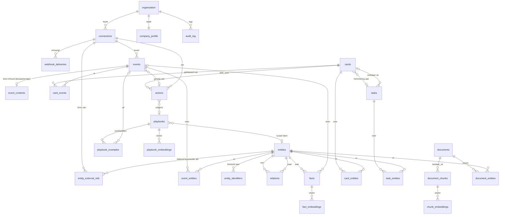
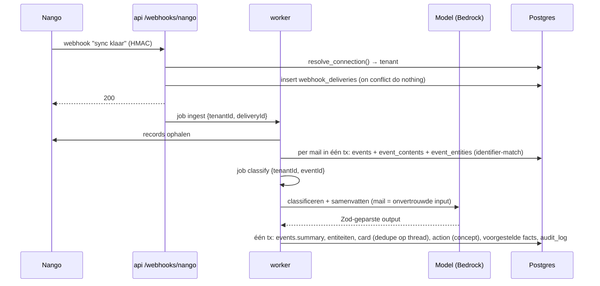

# Datamodel

Dit document beschrijft het schema van EffectiefAI 2.0. Elke schemawijziging werkt dit document bij in dezelfde PR (zie CLAUDE.md).
Beslissingen staan in `docs/decisions.md` (#033–#052). Status: **deels gebouwd**, zie [§3.10](#310-bouwstatus) voor wat er staat en waar de bouw afwijkt.

Inhoud:

1. [Overzicht](#1-overzicht)
2. [Principes](#2-principes)
3. [Algemene keuzes](#3-algemene-keuzes)
4. [Tabellen](#4-tabellen)
5. [Rechten van app_runtime](#5-rechten-van-app_runtime)
6. [Gegevensstromen](#6-gegevensstromen)
7. [Open vragen](#7-open-vragen)

---

## 1. Overzicht

Het model heeft twee delen die elkaar raken in `events` en `entities`:

- **Feed en acties:** wat binnenkomt (`connections`, `webhook_deliveries`, `events`), wat de gebruiker ziet (`cards`) en wat de gebruiker goedkeurt (`actions`). Alles wat gebeurt komt in `audit_log`.
- **Bedrijfsgeheugen**, in vier lagen:

| Laag | Vraag | Tabellen |
|---|---|---|
| Semantisch | Wat is waar? | `entities`, `entity_identifiers`, `entity_external_refs`, `relations`, `facts` |
| Procedureel | Hoe pakken we het aan? | `playbooks`, `playbook_examples` |
| Episodisch | Wat is er gebeurd? | `events` (append-only tijdlijn), `event_contents` (bron-inhoud met bewaartermijn) |
| Werkgeheugen | Wat speelt er nu? | `cards`, `tasks`, `insights` |

Plus documentkennis (`documents`, `document_chunks`) en `company_profile`. Embeddings staan in satelliettabellen per soort (`fact_embeddings`, `playbook_embeddings`, `chunk_embeddings`).

Alle tabellen hieronder zijn tenant-tabellen: `tenant_id` → `organization.id`, RLS en FORCE RLS. Gebruikers (`user`, `member`) komen uit Better Auth (#030, #031).



---

## 2. Principes

1. **Herleidbaarheid.** Alles wat de AI weet heeft een bron: `source_type` plus een getypte verwijzing (`source_event_id`, `source_chunk_id`, `source_user_id`, `source_action_id`). AI-output bewaart ook `ai_model` en `ai_trace_id` (Langfuse).
2. **AI stelt voor, mens bevestigt.** `facts`, `relations` en `playbooks` hebben een status. Het model schrijft alleen `proposed`; `confirmed` zet alleen een gebruikersactie, nooit een job of het model.
3. **Kennis veroudert.** `valid_from`/`valid_to` op `facts` en `relations`. Bij tegenspraak krijgt het oude feit een `valid_to` en `superseded_by_id`; de tekst wordt nooit overschreven (afgedwongen met kolomrechten, zie §5).
4. **Externe systemen zijn de bron van waarheid.** We bewaren verwijzingen (`entity_external_refs`, `provider_object_id`), geen kopieën van facturen, offertes of saldi. Een event mag een *historische momentopname* bevatten ("offerte van € 1.200 verstuurd op 3 okt"); de *actuele* stand halen we altijd live op.
5. **Dataminimalisatie.** Volledige bron-inhoud (mailtekst) staat in `event_contents` met een `retain_until`; samenvatting en verwijzing blijven in `events`. Vluchtig ("is deze week ziek", "offerte staat open") gaat naar de tijdlijn; alleen duurzame waarheden ("wil altijd gebeld worden", "is eigenaar van Bouwbedrijf X") worden een fact.
6. **Recht op vergetelheid** werkt door alle tabellen heen via foreign keys met `ON DELETE CASCADE` vanaf `entities` en `events`, inclusief embeddings. `audit_log` bevat geen persoonsgegevens en blijft staan.
7. **Tenant-isolatie.** Elke tabel: `tenant_id`, `tenantIsolation()`-policy, FORCE RLS, expliciete grants (#003, #026, #031). Verwijzingen tussen tenant-tabellen zijn samengestelde foreign keys op `(tenant_id, …)`, zodat zelfs een bug geen rij aan een andere tenant kan koppelen.

---

## 3. Algemene keuzes

### 3.1 Primaire sleutels en tijdstempels

- **UUIDv7** voor alle nieuwe tabellen, als database-default: `id uuid primary key default gen_uuid_v7()`. Postgres 17 heeft geen ingebouwde `uuidv7()` (pas in 18); de functie komt in een migratie (plpgsql, ±10 regels). Bij de overstap naar PG18 vervangen we de body door de ingebouwde functie.
  - Waarom v7: oplopend in de tijd, dus b-tree-inserts aan het eind van de index (geen willekeurige page splits zoals bij v4) en sorteren op `id` ≈ sorteren op aanmaakmoment.
  - Waarom in de database en niet in de app: ook ruwe SQL en migratie-backfills krijgen een geldig ID.
  - Nadeel: het ID verraadt het aanmaakmoment. Acceptabel; ID's zijn geen geheim en tenant-isolatie hangt er niet van af.
  - De Better Auth-tabellen houden `gen_random_uuid()` (v4); `tenant_id` is dus een v4.
- **Tenant-sleutel:** elke tabel heeft naast de PK een `unique (tenant_id, id)`. Verwijzingen gaan via `foreign key (tenant_id, x_id) references x (tenant_id, id)`. Waar een verwijzing `SET NULL` moet worden, gebruiken we de PG15+-vorm `on delete set null (x_id)` zodat `tenant_id` blijft staan. drizzle-kit genereert dat niet; die regels staan handgeschreven in de migratie.
- **`tenant_id`** → `organization(id) on delete cascade`: een tenant opzeggen verwijdert alles (RI-cascades omzeilen RLS, dat is hier gewenst).
  - Default: `nullif(current_setting('app.tenant_id', true), '')::uuid`, dus de tenant van de `withTenant()`-transactie. Repository-functies geven nooit een `tenant_id` mee en kunnen dus geen verkeerde meegeven; buiten `withTenant()` is de default `null` en faalt de insert (#043).
- **Tijdstempels:** altijd `timestamptz`, opgeslagen in UTC, getoond in Europe/Amsterdam. Elke tabel heeft `created_at` (default `now()`); muteerbare tabellen ook `updated_at` (`$onUpdate`, zoals `tenant_settings`). Domeintijd staat apart: `occurred_at` (wanneer het gebeurde) ≠ `created_at` (wanneer wij het vastlegden).
- **Verwijzingen naar gebruikers** (`*_user_id`): samengestelde FK `(tenant_id, x_user_id) → member(organization_id, user_id)`, zodat alleen leden van de tenant kunnen worden toegewezen. Daarvoor komt een `unique (organization_id, user_id)` op `member` (in onze migratie). `on delete set null (x_user_id)`; wie wat deed blijft in `audit_log`.

### 3.2 Koppeltabellen in plaats van `uuid[]`

Gekozen: **koppeltabellen** (`event_entities`, `card_events`, `card_entities`, `task_entities`, `document_entities`), elk met `tenant_id`.

| | Koppeltabel | `uuid[]` |
|---|---|---|
| Foreign keys | Ja, samengesteld met `tenant_id`: koppelen aan een rij van een andere tenant is onmogelijk | Nee; Postgres kent geen FK op array-elementen |
| RLS | Eigen policy, zelfde patroon als elke tabel | Erft van de rij, maar de inhoud van de array wordt niet gecontroleerd |
| forgetEntity | `on delete cascade` ruimt alles op | Elke array met `array_remove` bijwerken in elke tabel; makkelijk een te vergeten |
| Opvragen "alles over X" | b-tree op `(tenant_id, entity_id)` | GIN-index, minder voorspelbaar |
| Extra gegevens per koppeling | Ja (`role`: afzender, ontvanger, genoemd) | Nee |

Kosten: meer rijen en een join. Bij de verwachte omvang (duizenden events per tenant per maand) is dat verwaarloosbaar.

`facts.entity_id` is wél een gewone kolom: een feit gaat over precies één entiteit.

### 3.3 Statusvelden: `text` met check-constraint

Gekozen: `text` + `check (status in (...))`, geen Postgres-enum.

- Een enum-waarde verwijderen of hernoemen kan niet zonder het type opnieuw te maken; `ALTER TYPE … ADD VALUE` heeft beperkingen in transacties en drizzle-kit gaat er slecht mee om.
- Een check-constraint wijzigen is één gewone migratie (`drop constraint` + `add constraint`).
- De toegestane waarden staan één keer als `as const`-array in `packages/shared/src/domain/status.ts`. Daaruit komen het Zod-schema, het TypeScript-type en de check in het Drizzle-schema (`check('…', sql\`status in (${…})\`)`), dus ze lopen niet uit de pas.
- Statusovergangen staan in code (één functie per domein, met audit). Voor `actions` dwingt een trigger de toegestane overgangen ook in de database af (zie `actions`), omdat daar "nooit uitvoeren zonder akkoord" van afhangt.

Hetzelfde geldt voor andere gesloten lijsten (`type`, `kind`, `role`, `source_type`).

### 3.4 jsonb en Zod

Elke jsonb-kolom heeft een Zod-schema in `packages/shared/src/domain/` en een database-check `jsonb_typeof(col) = 'object'` (of `'array'`). Schrijven gaat altijd via `schema.parse()`; de kolom is in Drizzle getypeerd met `$type<z.infer<…>>()`. Schema's moeten achterwaarts compatibel blijven; een breuk krijgt een veld `v` en een migratiepad.

| Kolom | Zod-schema | Gediscrimineerd op |
|---|---|---|
| `entities.attributes` | `entityAttributesSchema` | `entities.type` |
| `facts.structured` | `factStructuredSchema` (`{ attribute, value, unit? }`) | — |
| `events.payload` | `eventPayloadSchemas` | `events.type` |
| `cards.payload` | `cardPayloadSchemas` | `cards.kind` |
| `actions.proposed_input`, `actions.input` | `actionInputSchemas` | `actions.type` |
| `actions.result` | `actionResultSchemas` (alleen ID's, nummers, status) | `actions.type` |
| `audit_log.metadata` | `auditMetadataSchemas` (geen vrije tekst, zie `audit_log`) | `audit_log.action` |
| `event_contents.attachments` | `attachmentMetaSchema[]` | — |
| `company_profile.opening_hours`, `.details` | `openingHoursSchema`, `companyDetailsSchema` | — |
| `insights.payload` | `insightPayloadSchemas` | `insights.kind` |

Model-output wordt eerst met het AI-schema in `packages/ai` geparst en daarna met het domeinschema hierboven voordat het in de database komt.

### 3.5 Embeddings: satelliettabellen per soort

Gekozen: **een embeddingtabel per soort eigenaar** (`fact_embeddings`, `playbook_embeddings`, `chunk_embeddings`), met per rij het model, de modelversie en de dimensie.

```
<x>_embeddings (
  tenant_id, <x>_id, model text, model_version text, dimensions smallint, embedding vector, created_at,
  primary key (<x>_id, model),
  foreign key (tenant_id, <x>_id) references <x> (tenant_id, id) on delete cascade,
  check (vector_dims(embedding) = dimensions),
  check ((model, model_version, dimensions) in (<combinaties uit models.ts>))
)
```

- `model` is de **vectorruimte** (sleutel in `embeddingModels`, bijv. `cohere-embed-v5`). Alleen vectoren met hetzelfde `model` en dezelfde `dimensions` worden met elkaar vergeleken.
- `model_version` is het **providermodel dat de vector maakte** (`embed-v5.0-pro`). Embed 5 Pro en Fast delen één ruimte: documenten met Pro, queries met Fast (#047).
- Een vector met een andere lengte dan het model voorschrijft wordt drie keer geweigerd: Zod in `storeEmbedding()`/`searchEmbeddings()`, `vector_dims(embedding) = dimensions`, en de check op `(model, model_version, dimensions)`. Die check wordt in het Drizzle-schema gegenereerd uit `packages/ai/models.ts`; een nieuw model is dus ook een migratie.

Afgewogen:

| | Vaste kolom per tabel (`facts.embedding vector(1024)`) | Eén generieke `embeddings`-tabel | **Satelliet per soort** |
|---|---|---|---|
| FK + cascade bij forget | Ja | Alleen met een nullable FK per soort | Ja |
| Twee modellen naast elkaar tijdens herembedden | Nee (tweede kolom + migratie) | Ja | Ja |
| HNSW-index | Eenvoudig | Partieel per model én soort, in één grote tabel | Partieel per model, per tabel |
| Zoeken | Per soort | Altijd filteren op soort | Per soort (zo zoeken we toch) |

- **HNSW** vereist een vaste dimensie. Daarom per actief model een partiële expressie-index in een migratie:
  `create index … on chunk_embeddings using hnsw ((embedding::vector(1024)) vector_cosine_ops) where model = 'cohere-embed-v5' and dimensions = 1024;`
  De zoekquery gebruikt exact dezelfde expressie en predicaat, met het model en de dimensie als letterlijke waarden (geen parameters), zodat de planner de partiële index kan gebruiken. `vector` met HNSW kan tot 2000 dimensies; daarboven is `halfvec` nodig.
- **RLS en ANN:** RLS filtert ná de indexscan, dus bij een kleine tenant tussen veel andere kan HNSW te weinig resultaten geven. Daarom: zoekhelper zet `set local hnsw.iterative_scan = relaxed_order` (pgvector ≥ 0.8) en filtert expliciet op `tenant_id` (naast RLS), en er is een b-tree op `(tenant_id, model)` zodat de planner bij kleine tenants exact kan zoeken. Dit meten we met de evalset; partitioneren per tenant pas als het nodig is.
  - Gemeten in `knowledge/isolation.test.ts`: met `ef_search = 10` en 300 rijen van een andere tenant vlak bij de query geeft een gewone HNSW-scan voor de kleine tenant **niets** terug; met de iterative scan wel de eigen rij. Een tenant krijgt in geen van beide gevallen rijen van een ander.
- **Model en dimensie** komen uit `packages/ai/models.ts` (`embeddingModels`, met `documentVersion` en `queryVersion`), met per soort het actieve model (`activeEmbeddingModels`). `embedDocument` schrijft, `embedQuery` zoekt; de ruimte (`model`, `dimensions`) van de query moet gelijk zijn aan die van de opgeslagen rijen.
- **Gekozen model (#047):** Cohere Embed 5 via de Cohere API, 1024 dimensies (Matryoshka), `vector` (float). Pro voor documenten, Fast voor queries.
- **Opnieuw embedden:** (1) nieuw model in `models.ts` + migratie met de HNSW-index; (2) backfill-job per tenant schrijft rijen voor elke eigenaar zonder rij voor het nieuwe model (idempotent door de PK); (3) evalset draaien en drempels herijken; (4) actief model omzetten; (5) job verwijdert rijen van het oude model, migratie verwijdert de oude index.
- **Persoonsgegevens:** embeddings zijn afgeleid van inhoud en gelden als persoonsgegevens (V). Ze verdwijnen via cascade met hun eigenaar.

`entities` krijgt in eerste instantie geen embedding: matchen gaat via `entity_identifiers` (exact) en eventueel `pg_trgm` op `name` (fase 2).

### 3.6 Bronverwijzing (herleidbaarheid)

Tabellen met AI-kennis (`facts`, `relations`, `playbooks`, `tasks`, `insights`) gebruiken hetzelfde patroon:

| Kolom | Type | Betekenis |
|---|---|---|
| `source_type` | text, check | `event` · `document` · `user` · `action` · `system` |
| `source_event_id` | uuid null | FK `events`, `on delete set null (source_event_id)` |
| `source_chunk_id` | uuid null | FK `document_chunks`, idem |
| `source_user_id` | uuid null | FK `member`, idem |
| `source_action_id` | uuid null | FK `actions`, idem |
| `ai_model` | text null | Sleutel uit `models.ts` als de AI het voorstelde |
| `ai_trace_id` | text null | Langfuse-trace |

Bij het schrijven controleert Zod dat precies de verwijzing hoort bij `source_type` gevuld is. In de database geen check die dat afdwingt, omdat een bron later kan verdwijnen (retentie, ontkoppelen) en de verwijzing dan `null` wordt; `source_type` blijft staan en laat zien wat voor bron het was.

Gekozen boven één `source_ref text` (zoals in het startpunt): getypte FK's laten de database bijhouden wanneer een bron verdwijnt, en forgetEntity hoeft geen tekstverwijzingen te zoeken.

### 3.7 Persoonsgegevens markeren

Elke kolom van een tenant-tabel krijgt een klasse in één register, `packages/db/src/pii.ts`:

| Klasse | Betekenis | Voorbeelden |
|---|---|---|
| `P` | Direct identificerend | naam, e-mailadres, telefoon, adres, KvK van een eenmanszaak |
| `I` | Vrije inhoud die persoonsgegevens kan bevatten | samenvatting, mailtekst, feitstatement, conceptmail |
| `V` | Afgeleid van inhoud | embedding |
| `—` | Geen persoonsgegevens | ID's, status, tijdstempels, bedragen |

Gebruik:

- **Test:** elke kolom van elke tabel met `tenant_id` (uit `information_schema`) moet in het register staan; een nieuwe kolom zonder klasse laat de test falen.
- **Logging:** de kolomnamen met `P` en `I` worden toegevoegd aan de redaction-sleutels in `packages/shared/src/logging.ts`. Regel blijft: log ID's, geen rijen.
- **forgetEntity:** de test controleert dat elke tabel met `P`/`I`/`V`-kolommen via cascade bereikbaar is vanaf `entities` of `events`, of expliciet in de forget-stap staat.

In de tabellen hieronder staat de klasse in de kolom **PG**.

### 3.8 Verwijderen: hard, zacht en audit

- **Hard verwijderen** voor alles wat persoonsgegevens bevat en weg moet (forget, retentie, ontkoppelen, tenant opzeggen). Geen `deleted_at` op zulke rijen: een zachte verwijdering houdt de persoonsgegevens vast.
- **Zacht** (status of `archived_at`) waar de gebruiker iets "weglegt" maar het nog bestaat: entiteiten archiveren, kaarten afwijzen, playbooks intrekken, feiten verwerpen of laten verlopen.
- **`audit_log`** verwijst met ID's zonder FK, bevat geen persoonsgegevens, en overleeft dus elke harde verwijdering. Elke harde verwijdering door een gebruiker, forget of retentie schrijft een audit-regel met de ID's of aantallen.

Per tabel staat het in de sectie **Verwijderen**.

### 3.9 Fasering

| Fase | Wat | Tabellen krijgen logica |
|---|---|---|
| **1 — MVP-keten** (#008) | mail → kaart → offerte → betaling | `connections`, `webhook_deliveries`, `events`, `event_contents`, `event_entities`, `entities`, `entity_identifiers`, `entity_external_refs`, `cards`, `card_events`, `card_entities`, `actions`, `audit_log`, `company_profile` |
| **2 — Geheugen** | leren van correcties | `facts`, `fact_embeddings`, `relations`, `playbooks`, `playbook_examples`, `playbook_embeddings`, `tasks`, `task_entities` |
| **3 — Kennis** | documenten en afgeleide inzichten | `documents`, `document_chunks`, `chunk_embeddings`, `document_entities`, `insights` |

Alle tabellen van fase 1, 2 en 3 staan er (open vraag 1, #049); de logica volgt per fase.

### 3.10 Bouwstatus

| Tabel | Status | Migratie |
|---|---|---|
| `tenant_settings` (+ `content_retention_days`) | gebouwd | 0002, 0005 |
| `entities`, `entity_identifiers`, `relations` | gebouwd | 0005, 0006 |
| `events`, `event_contents`, `event_entities` | gebouwd | 0005, 0006 |
| `tasks`, `task_entities` | gebouwd | 0005, 0006 |
| `connections`, `entity_external_refs` | gebouwd | 0007, 0008 |
| `cards`, `card_events`, `card_entities` | gebouwd | 0007, 0008 |
| `actions`, `audit_log` | gebouwd | 0007, 0008 |
| `events.connection_id`, `events.caused_by_action_id`, `tasks.origin_card_id`, `source_action_id` | gebouwd | 0007 |
| `facts`, `fact_embeddings` | gebouwd | 0009, 0010 |
| `playbooks`, `playbook_examples`, `playbook_embeddings`, view `playbook_usage` | gebouwd | 0009, 0010 |
| `documents`, `document_chunks`, `chunk_embeddings`, `document_entities` | gebouwd | 0009, 0010 |
| `company_profile`, `insights` | gebouwd | 0009, 0010 |
| `source_chunk_id`, `actions.playbook_id` | gebouwd | 0009 |
| `actions.execution_job_id`, `cards.action_id`, status `executing`, kaartsoort `action_failed` | gebouwd | 0011, 0012 |
| `audit_log`: acties `entity.forgotten` en `retention.purged`, objecttypes `entities` en `event_contents` | gebouwd | 0013 |
| `list_tenant_ids()` | gebouwd | 0014 |
| `webhook_deliveries`, `resolve_connection()` | ontwerp | |

Ook gebouwd: `gen_uuid_v7()` (0004), `unique (organization_id, user_id)` op `member` (0005), het PII-register `packages/db/src/pii.ts`, repository-functies in `packages/db/src/memory/`, `packages/db/src/feed/` en `packages/db/src/knowledge/`, en de datalevenscyclus in `packages/db/src/lifecycle/` (retentie, forgetEntity, ontkoppelen en purgen; #052). API-procedures: `tenant.*`, `cards.list`, `cards.get`, `actions.approve`, `actions.reject`, `entities.get`. Nog geen extractie, leren of RAG.

**Statusovergangen (#044).** `connections`, `cards` en `actions` veranderen van status alleen via `transitionConnection()`, `transitionCard()` en `transitionAction()`. Die controleren de overgang tegen de lijsten in `packages/shared/src/domain/transitions.ts`, doen `UPDATE … WHERE id = … AND status = <verwacht>` en schrijven in dezelfde transactie één regel in `audit_log`. Matcht de update geen rij, dan volgt `TransitionError` met `status_changed` (iemand anders was eerst) of `not_found`. In de database:

- `status_transition_guard()`: een trigger per tabel met dezelfde `from:to`-paren als argumenten; een test vergelijkt ze met de lijsten.
- `initial_status_guard()`: nieuwe rijen beginnen als `active`, `open`, `concept` of (`facts`, `playbooks`) `proposed`.

| Tabel | Overgangen |
|---|---|
| `connections` | `active → revoked \| expired`, `expired → active \| revoked \| purged`, `revoked → purged` |
| `cards` | `open → snoozed \| done \| dismissed \| expired`, `snoozed → open \| done \| dismissed \| expired` |
| `actions` | `concept → approved \| rejected`, `approved → executing`, `executing → executed \| failed`, `failed → approved \| concept`, `executed → concept` (niet voor definitieve types, #050) |
| `facts` | `proposed → confirmed \| rejected` |
| `playbooks` | `proposed → confirmed \| rejected`, `confirmed → retired` |

`expired → active` is opnieuw autoriseren via Nango (zelfde `nango_connection_id`). `revoked` en `purged` zijn eindstatussen: opnieuw koppelen is een nieuwe connectie. Naar `approved` en `rejected` kan alleen een actor van het type `user`; hetzelfde geldt voor bevestigen, afwijzen en intrekken van feiten en playbooks.

**Kennis (facts, playbooks).** Een bevestigd feit krijgt geen andere status meer: het eindigt met `valid_to`. De functies in `packages/db/src/knowledge/`:

- `confirmFact()`: `proposed → confirmed`. Heeft de entiteit al een geldend, bevestigd feit met hetzelfde `attribute`, dan krijgt dat in dezelfde transactie `valid_to` en `superseded_by_id`.
- `replaceFact()`: correctie door de gebruiker (§6.2 stap 5). Het oude feit (moet bevestigd en geldend zijn) krijgt `valid_to = now()`, er komt een nieuw, bevestigd feit met `valid_from` gelijk aan die `valid_to`, en het oude krijgt `superseded_by_id`. Nog een keer vervangen geeft `KnowledgeError('not_current')`.
- `confirmPlaybook()`: bij een nieuwe versie wordt de vorige in dezelfde transactie `retired`; is die al niet meer `confirmed` (een andere versie won), dan faalt alles.
- Audit: `fact.confirmed`, `fact.rejected`, `fact.superseded`, `playbook.confirmed`, `playbook.rejected`, `playbook.retired`, alleen met ID's, scope en versie.

**Afwijkingen van het ontwerp in de bouw:**

- **Kolommen naar tabellen die nog niet bestaan** komen pas met hun doeltabel, mét samengestelde FK (#042). Een kolom zonder FK zou in de tussentijd naar een rij van een andere tenant kunnen wijzen.
  - Alle verwijzende kolommen uit het ontwerp staan er nu; `sourceRefSchema` accepteert alle vijf bronsoorten.
- **Nog niet gebouwd bij `connections`:** de functie `resolve_connection()` (#038). Die komt met de webhook-PR. `list_tenant_ids()` staat er (0014).
- **Datalevenscyclus (#052)**, afwijkend van of aanvullend op het ontwerp hieronder:
  - Retentie: de stap voor `webhook_deliveries` ontbreekt (tabel bestaat nog niet). Inputs van acties worden geleegd 180 dagen na de laatste statuswijziging (`updated_at`) in `executed`, `rejected` of `failed`. Elke batch is een eigen transactie met een eigen audit-regel.
  - forgetEntity neemt ook entiteiten mee die in de persoon zijn samengevoegd (`merged_into_id`, recursief). De restcontrole in vrije tekst (§6.3 stap 3) is niet gebouwd (open vraag 5, docs/todo.md).
  - Purgen van een connectie verwijdert ook kaarten (bij haar events, met een actie via haar, of `connection_problem` van haar) en documenten met `origin = 'connection'`. Een actieve connectie wordt geweigerd: eerst `disconnectConnection()` (`→ revoked`). Intrekken bij Nango is niet gebouwd.
- **`tenant_id` heeft een default** uit de transactie (§3.1, #043), ook als primaire sleutel van `company_profile`.
- **Fase 3 al aangemaakt:** `documents`, `document_chunks`, `chunk_embeddings`, `document_entities` en `insights` staan er al (open vraag 1), zonder verwerkingslogica.
- **Extra checks:**
  - `events`: `(summary is null) = (summarized_at is null)`.
  - `relations`: `status <> 'confirmed' or confirmed_at is not null`.
  - `tasks`: `(status = 'done') = (completed_at is not null)`.
  - `entities`: `merged_into_id <> id`.
  - `connections`: `status <> 'purged' or account_label is null`; `status_reason` is een gesloten lijst (`invalid_grant`, `provider_revoked`, `user_disconnected`, `reauthorized`, `data_purged`).
  - `cards`: `(status = 'snoozed') = (snoozed_until is not null)`; `(kind = 'connection_problem') = (connection_id is not null)`; `(kind = 'task_due') = (task_id is not null)`; `(kind = 'action_failed') = (action_id is not null)`; `priority between 0 and 3`. `cards.connection_id` en `cards.action_id` zijn `on delete cascade`.
  - `actions`: `(input_purged_at is null) = (proposed_input is not null and input is not null)`; `attempts >= 0`; `status <> 'executing' or execution_job_id is not null`; `last_error_code` is een gesloten lijst (`actionErrorCodes`).
  - `audit_log`: `(actor_type = 'user') = (actor_user_id is not null)`.
  - `facts`: `superseded_by_id is null or valid_to is not null`; `superseded_by_id <> id`; `structured->>'attribute' = attribute`. Trigger `facts_end_once`: `valid_to` en `superseded_by_id` zijn eenmalig (behalve `set null` via de FK).
  - `playbooks`: `version >= 1`; `supersedes_id <> id`; `scope_user_id` is `on delete cascade` (een persoonlijk playbook verdwijnt met het lid).
  - `playbook_examples`: `source_event_id is not null or source_action_id is not null`.
  - `documents`: `(origin = 'connection') = (connection_id is not null and external_id is not null)`; `sha256` is 64 hex-tekens (kleine letters); `unique (tenant_id, sha256)`.
  - `insights`: `(kind = 'payment_behaviour') = (entity_id is not null)` (afgeleid uit `insightPerEntity`); `expires_at > computed_at`.
- **`entity_external_refs.provider`** neemt `addEntityExternalRef()` over van de connectie, zodat die twee niet kunnen verschillen.
- **Geen check op `confirmed_by_user_id`** bij `relations`, `facts` en `playbooks`, maar op `confirmed_at`. Die kolom wordt `null` als het lid verdwijnt (`set null`), en een check zou het verwijderen van een lid dan blokkeren.
- **`insights` zonder bronkolommen**, ook al noemt §3.6 ze: inzichten worden deterministisch berekend, niet voorgesteld door de AI.
- **Soorten inzichten:** `open_quotes` (bedrijfsbreed: aantal, ouder dan N dagen, totaal in centen) en `payment_behaviour` (per klant: aantal facturen, gemiddeld aantal dagen te laat).
- **`playbook_usage`** telt alleen uitgevoerde acties (`times_applied`, `last_applied_at`) en is `security_invoker`, zodat RLS van `playbooks` en `actions` geldt.
- **`events.payload` is PG-klasse `—`**: de Zod-schema's staan geen vrije tekst toe (alleen ID's, documentnummers, bedragen en enums).

---

## 4. Tabellen

**Standaardkolommen**, niet herhaald per tabel tenzij afwijkend:

| Kolom | Type | Betekenis |
|---|---|---|
| `id` | uuid PK, default `gen_uuid_v7()` | |
| `tenant_id` | uuid not null, FK `organization` cascade | |
| `created_at` | timestamptz not null default `now()` | |
| `updated_at` | timestamptz not null | alleen bij muteerbare tabellen |

**Standaard constraints en RLS:** `unique (tenant_id, id)`, index op `tenant_id` als eerste kolom van de belangrijkste index, `tenantIsolation(tenant_id)`, `FORCE ROW LEVEL SECURITY`, grants zoals in §5.

### Deel A — Feed en acties

#### `connections`

**Doel:** een gekoppelde integratie van een tenant, verwijzend naar een Nango-connectie. Tokens staan in Nango, niet hier.

| Kolom | Type | Betekenis | PG |
|---|---|---|---|
| `provider` | text, check | `gmail` · `outlook` · `moneybird` · `mollie` (uitbreidbaar) | — |
| `nango_integration_id` | text not null | Integratie-ID in Nango | — |
| `nango_connection_id` | text not null | Connectie-ID in Nango | — |
| `external_account_id` | text null | Account bij de provider (bijv. Moneybird-administratie-ID) | — |
| `account_label` | text null | Wat de gebruiker ziet, bijv. het mailadres van de mailbox | P |
| `status` | text, check | `active` · `revoked` · `expired` · `purged` | — |
| `status_reason` | text null | Code, bijv. `invalid_grant`, `user_disconnected` | — |
| `status_changed_at` | timestamptz | | — |
| `last_synced_at` | timestamptz null | | — |
| `connected_by_user_id` | uuid null | FK `member` | — |

- **Constraints:** `unique (nango_connection_id)` (globaal; Nango-ID's zijn uniek per omgeving); partieel `unique (tenant_id, provider, external_account_id) where status = 'active'`.
- **Indexen:** `(tenant_id, status)`.
- **Tenant opzoeken bij webhooks:** de webhook weet alleen `nango_connection_id`. Opzoeken over tenants heen mag de app-rol niet. Daarvoor één smalle `SECURITY DEFINER`-functie `resolve_connection(provider, nango_connection_id) returns (tenant_id, connection_id)`, alleen uitvoerbaar door `app_runtime` (#038).
- **Verwijderen:** zacht. Ontkoppelen: `disconnectConnection()` (`revoked`) → job `purge-connection` met `purgeConnection()`: verwijdert events, `entity_external_refs`, documenten en kaarten van de connectie, en entiteiten die daarna nergens meer aan hangen (zie §6.3) → `purged`, `account_label` wordt `null`, aantallen in de audit-regel. De rij blijft als grafsteen voor audit en voor late webhooks.
- **Retentie:** zolang de tenant bestaat.
- **Fase:** 1.

#### `webhook_deliveries`

**Doel:** de inbox van #013. Een ontvangen webhook, opgeslagen vóór verwerking. Transport, geen domein: een Nango-webhook "sync klaar" is geen gebeurtenis voor de tijdlijn.

| Kolom | Type | Betekenis | PG |
|---|---|---|---|
| `connection_id` | uuid not null | FK `connections` | — |
| `source` | text, check | `nango` · `mollie` | — |
| `delivery_id` | text not null | Uniek ID van de bron, of sha256 van de ruwe body als de bron er geen heeft | — |
| `received_at` | timestamptz | | — |
| `payload` | jsonb not null | Geparste body na handtekeningcontrole (Zod per bron). Nango-sync-webhooks bevatten geen inhoud, alleen model en aantallen | I |
| `status` | text, check | `received` · `processed` · `failed` | — |
| `attempts` | smallint | | — |
| `last_error_code` | text null | Geen foutmelding met inhoud | — |
| `processed_at` | timestamptz null | | — |

- **Constraints:** `unique (tenant_id, source, delivery_id)` — dubbele levering wordt `on conflict do nothing` en geeft gewoon 200.
- **Indexen:** `(tenant_id, status, received_at)` voor het opnieuw inplannen van blijvende `failed`.
- **Verwijderen/retentie:** hard. `processed` na 30 dagen. `failed` blijft tot hij alsnog verwerkt is of handmatig afgesloten (een fout verdwijnt nooit stil).
- **Fase:** 1.

#### `events`

**Doel:** de episodische tijdlijn. Eén rij per gebeurtenis in de wereld van de klant: een mail ontvangen of verstuurd, een betaling ontvangen, een offerte geaccepteerd, een actie uitgevoerd, een notitie van de gebruiker. Append-only.

| Kolom | Type | Betekenis | PG |
|---|---|---|---|
| `connection_id` | uuid null | FK `connections`; `null` voor events uit de app zelf | — |
| `source` | text, check | `gmail` · `outlook` · `moneybird` · `mollie` · `app` | — |
| `external_id` | text not null | ID bij de bron (message-ID, payment-ID); voor `app` het ID van de oorzaak | — |
| `type` | text, check | `email.received` · `email.sent` · `quote.sent` · `quote.accepted` · `invoice.sent` · `payment.paid` · `payment.failed` · `action.executed` · `note.added` · … | — |
| `occurred_at` | timestamptz not null | Wanneer het gebeurde (niet wanneer wij het zagen) | — |
| `thread_key` | text null | Gespreks-ID bij de bron (Gmail-thread, Outlook-conversation) voor groeperen | — |
| `summary` | text null | Korte samenvatting door de AI; blijft na het verlopen van de bron-inhoud | I |
| `summarized_at` | timestamptz null | | — |
| `payload` | jsonb not null | Minimale metadata per type (Zod), bijv. richting, provider-object-ID, momentopname van bedrag in centen + btw-tarief. Geen mailtekst, geen adressen | — / I |
| `caused_by_action_id` | uuid null | FK `actions`, `set null`; bij `action.executed` | — |

- **Constraints:** `unique (tenant_id, source, external_id)` (CLAUDE.md).
- **Indexen:** `(tenant_id, occurred_at desc)`; `(tenant_id, thread_key)`; `(tenant_id, type, occurred_at desc)`.
- **Append-only:** geen UPDATE behalve `summary` en `summarized_at` (kolomrecht), want samenvatten gebeurt in een latere job. De trigger `events_summary_once` staat dat alleen toe zolang `summary is null`; daarna geeft hij `integrity_constraint_violation`. `setEventSummary()` werkt met `where summary is null` en geeft `false` terug als er al een samenvatting was.
- **Payload per type** (`packages/shared/src/domain/event.ts`): mail `{ attachmentCount? }`; offerte en factuur `{ providerObjectId, documentNumber?, totalExclVatCents, vatRateBps }`; betaling `{ providerPaymentId, amountCents, currency: 'EUR', failureCode? }`; `action.executed` `{ providerObjectId }`; `note.added` `{}` (de tekst van een notitie hoort in `event_contents`).
- **Idempotent opnemen:** `recordEvent()` doet `on conflict (tenant_id, source, external_id) do nothing` en geeft dan het bestaande event terug (`created: false`), zonder de inhoud aan te raken.
- **Persoonsgegevens:** `summary` (I). `payload` mag volgens het Zod-schema geen vrije tekst bevatten; momentopnames zijn ID's, nummers en bedragen.
- **Verwijderen:** hard, alleen door forgetEntity en het ontkoppelen van een connectie. Cascade naar `event_contents`, `event_entities`, `card_events`, `playbook_examples`; `set null` op bronverwijzingen.
- **Retentie:** zolang de tenant bestaat (de bron-inhoud niet, zie `event_contents`). Zie open vraag 4.
- **Fase:** 1.

#### `event_contents`

**Doel:** de volledige bron-inhoud van een event, met bewaartermijn. Apart van `events` zodat de tijdlijn append-only en smal blijft.

| Kolom | Type | Betekenis | PG |
|---|---|---|---|
| `event_id` | uuid PK | FK `(tenant_id, event_id)` → `events`, cascade | — |
| `tenant_id` | uuid | | — |
| `from_address` | text null | | P |
| `to_addresses` | text[] null | | P |
| `subject` | text null | | I |
| `body_text` | text null | Platte tekst, na verwijderen van quotes en handtekeningen waar mogelijk. Geen HTML | I |
| `attachments` | jsonb null | `[{ name, mimeType, size, providerAttachmentId }]`; bestanden zelf blijven bij de provider | I |
| `retain_until` | timestamptz not null | `occurred_at` + bewaartermijn van de tenant | — |
| `created_at` | timestamptz | | — |

**Waarom een aparte tabel en geen kolom op `events`:**

- Retentie verwijdert een rij in plaats van een UPDATE op een append-only tabel.
- Eigen grants: wie de tijdlijn leest, hoeft de inhoud niet te kunnen lezen (later bruikbaar voor een rol per functie).
- De tijdlijn-scan raakt geen grote tekstvelden (TOAST).
- De bron blijft bij de provider: na verloop kan een gebruiker "toon originele mail" doen via `external_id`, zolang de connectie actief is.

**Retentie-job:** in de queue `retention` draait een herhaalde job `sweep` (dagelijks, 03:00 Europe/Amsterdam, via een BullMQ job scheduler). Hij haalt de tenant-ID's op via de `SECURITY DEFINER`-functie `list_tenant_ids()` (alleen ID's) en zet per tenant een job `tenant` met `{ tenantId }` (job-ID per tenant per dag). Die job verwijdert binnen `withTenant()` in batches van 1.000 (`purgeExpiredBatch()`, elke batch een eigen transactie) alles waarvan de termijn verlopen is:

1. `event_contents` met `retain_until < now()`;
2. `actions.proposed_input` en `input` van acties die langer dan 180 dagen in `executed`, `rejected` of `failed` staan (gemeten op `updated_at`; `input_purged_at` wordt gezet);
3. `webhook_deliveries` met `status = 'processed'` ouder dan 30 dagen (nog niet gebouwd: de tabel bestaat nog niet);
4. `cards` die langer dan 12 maanden gesloten zijn (cascade naar koppelingen).

Per stap (en batch) met resultaat één audit-regel `retention.purged` met `{ step, count }`. Mislukt een batch, dan retryt de job (standaard BullMQ-opties); de selectie is idempotent.

- **Bewaartermijn:** `tenant_settings.content_retention_days` (default 90, check 30–365). `retain_until` = `occurred_at` + die termijn, berekend bij het opnemen. Zie open vraag 3.
- **Indexen:** `(tenant_id, retain_until)`.
- **Fase:** 1.

#### `event_entities`

**Doel:** welke entiteiten bij een event horen, en in welke rol.

| Kolom | Type | Betekenis | PG |
|---|---|---|---|
| `tenant_id`, `event_id`, `entity_id` | uuid | PK `(event_id, entity_id, role)`; FK's samengesteld met `tenant_id`, cascade | — |
| `role` | text, check | `sender` · `recipient` · `subject` · `mentioned` | — |
| `linked_by` | text, check | `rule` (identifier-match) · `ai` · `user` | — |
| `created_at` | timestamptz | | — |

- **Indexen:** `(tenant_id, entity_id, event_id)` voor "alles over X".
- **Verwijderen:** hard (gebruiker corrigeert een koppeling; cascade). **Fase:** 1.

#### `cards`

**Doel:** wat de gebruiker in de feed ziet. Een kaart vat samen en vraagt om een beslissing, vandaag. Kort levend.

| Kolom | Type | Betekenis | PG |
|---|---|---|---|
| `kind` | text, check | `email_reply` · `quote_request` · `payment_overdue` · `connection_problem` · `knowledge_review` (feiten/playbooks bevestigen) · `task_due` · `insight` · `action_failed` (uitvoeren mislukt, #050) | — |
| `status` | text, check | `open` · `snoozed` · `done` · `dismissed` · `expired` | — |
| `title` | text not null | | I |
| `summary` | text null | | I |
| `payload` | jsonb not null | Per `kind` (Zod) | — / I |
| `priority` | smallint | 0–3 | — |
| `dedupe_key` | text null | Bijv. `thread:<thread_key>` of `connection:<id>`; voorkomt dubbele kaarten | — |
| `connection_id` | uuid null | FK; bij `connection_problem` | — |
| `task_id` | uuid null | FK `tasks`, cascade; bij `task_due` | — |
| `action_id` | uuid null | FK `actions`, cascade; bij `action_failed` | — |
| `snoozed_until` | timestamptz null | | — |
| `resolved_at` | timestamptz null | | — |
| `resolved_by_user_id` | uuid null | FK `member` | — |
| `ai_model`, `ai_trace_id` | text null | | — |

- **Constraints:** partieel `unique (tenant_id, dedupe_key) where status in ('open', 'snoozed')`; `check ((status in ('done','dismissed','expired')) = (resolved_at is not null))`.
- **Indexen:** `(tenant_id, status, priority desc, created_at desc)` voor de feed.
- **Koppelingen:** `card_events` (`tenant_id`, `card_id`, `event_id`, PK `(card_id, event_id)`) en `card_entities` (`tenant_id`, `card_id`, `entity_id`, PK `(card_id, entity_id)`), beide cascade aan beide kanten en met index op de tweede kolom. `card_entities` is deels af te leiden uit de events, maar staat apart voor kaarten zonder event (`task_due`, `insight`) en voor snel filteren in de feed.
- **Verwijderen:** zacht via status. Hard na 12 maanden gesloten (retentie) en via forgetEntity.
- **Fase:** 1.

#### `actions`

**Doel:** een voorgestelde schrijfactie bij een kaart. Loopt door `proposeAction → approve → execute` (#004).

| Kolom | Type | Betekenis | PG |
|---|---|---|---|
| `card_id` | uuid not null | FK `cards`, cascade | — |
| `connection_id` | uuid not null | FK `connections`; via welke koppeling | — |
| `type` | text, check | `email.reply` · `moneybird.quote` · `moneybird.invoice_reminder` · `mollie.payment_link` · … | — |
| `status` | text, check | `concept` · `approved` · `executing` · `executed` · `failed` · `rejected` | — |
| `proposed_input` | jsonb null | Wat de AI voorstelde, onveranderlijk. Basis voor leren van correcties | I |
| `input` | jsonb null | Wat de gebruiker goedkeurde (na bewerken) | I |
| `input_purged_at` | timestamptz null | Gezet door retentie; dan zijn beide inputs `null` | — |
| `idempotency_key` | text not null | Afgeleid van `card_id` + `type` + volgnummer, deterministisch | — |
| `provider_object_id` | text null | ID van het concept/object bij de provider | — |
| `result` | jsonb null | Minimale metadata van de provider (nummer, status), Zod | — |
| `playbook_id` | uuid null | FK `playbooks`, `set null`; volgens welk playbook | — |
| `approved_by_user_id` | uuid null | FK `member` | — |
| `approved_at`, `executed_at` | timestamptz null | | — |
| `attempts` | smallint | Hoe vaak een execute-job de actie claimde | — |
| `execution_job_id` | text null | De job die de actie claimde (`executing`); alleen die rondt af | — |
| `last_error_code` | text null, check | Gesloten lijst `actionErrorCodes` (`provider_unavailable`, `auth_expired`, `rejected_by_provider`, …); nooit een providermelding | — |
| `ai_model`, `ai_trace_id` | text null | | — |

- **Constraints:** `unique (tenant_id, idempotency_key)`; `check (status <> 'executed' or provider_object_id is not null)`; `check (status in ('concept','rejected') or approved_at is not null)` — uitgevoerd of goedgekeurd kan niet zonder akkoord. De check staat op `approved_at` en niet op `approved_by_user_id`, omdat die laatste `null` wordt als het lid verdwijnt (#046). Dat het een gebruiker was, dwingt `transitionAction()` af en staat in `audit_log`.
- **Triggers:** `actions_status_guard` met de overgangen `concept → approved | rejected`, `approved → executing` (een job claimt), `executing → executed | failed`, `failed → approved` (opnieuw proberen na akkoord), `failed → concept` (bewerken na een fout), `executed → concept` (bewerken na uitvoeren: wordt een update van hetzelfde provider-object). `actions_final_guard` weigert `executed → concept` voor definitieve types (`email.reply`, `moneybird.invoice_reminder`; `afterExecute: 'final'` in `actionRegistry`). `actions_guard`:
  - een nieuwe actie heeft geen akkoord, uitvoering of provider-object, en `input = proposed_input`;
  - `input` mag alleen wijzigen vanuit `concept`;
  - `proposed_input` nooit;
  - `provider_object_id` niet meer zodra hij gezet is.
  Alleen retentie mag beide inputs legen, samen met `input_purged_at`.
- **Idempotency-key:** `<card_id>:<type>:<ordinal>`; de job geeft het volgnummer mee (standaard 1). Een herhaald voorstel geeft de bestaande actie terug (`created: false`).
- **Voorstellen** (`proposeAction()`) kan alleen via een actieve connectie van een provider die het type kan uitvoeren (`actionProviders` in `packages/shared/src/domain/action.ts`).
- **Bewerken na uitvoeren:** het `provider_object_id` blijft; uitvoeren doet dan een update bij de provider, nooit een nieuw object. Niet voor definitieve types: een verstuurde mail is niet bij te werken.
- **Uitvoeren** (#050, `packages/db/src/feed/execution.ts`, job `execute-action`): `claimExecution()` zet `approved → executing` met `execution_job_id` (alleen vanuit `approved`, dus nooit zonder akkoord; van twee jobs wint er één; een retry van dezelfde job gaat verder). Daarna de adapter, buiten een transactie, met de idempotency-key en het eventuele `provider_object_id`. Dan in één transactie `completeExecution()` (`executed`, event `action.executed`, kaart `done`) of `failExecution()` (`failed`, `last_error_code`, kaart `action_failed`; bij `auth_expired` ook connectie `expired` met kaart `connection_problem`). Opnieuw goedkeuren of bewerken na een fout sluit de kaart `action_failed`.
- **Indexen:** `(tenant_id, card_id)`; `(tenant_id, status)`; `(tenant_id, playbook_id)`.
- **Verwijderen:** niet door de app; hard via cascade van `cards` (retentie, forget). Inputs worden geleegd door retentie (180 dagen na eindstatus, voorstel).
- **Fase:** 1.

#### `audit_log`

**Doel:** append-only logboek van alles wat er gebeurde en door wie. Geen persoonsgegevens, zodat het elke verwijdering overleeft.

| Kolom | Type | Betekenis | PG |
|---|---|---|---|
| `id` | uuid PK (v7) | | — |
| `tenant_id` | uuid | FK `organization` cascade | — |
| `occurred_at` | timestamptz | | — |
| `actor_type` | text, check | `user` · `agent` · `system` | — |
| `actor_user_id` | uuid null | **Geen FK**: moet blijven bestaan als de gebruiker weg is | — |
| `action` | text, check | `action.proposed` · `action.approved` · `action.started` · `action.executed` · `fact.confirmed` · `entity.forgotten` · `connection.revoked` · `retention.purged` · … | — |
| `object_type` | text, check | Tabelnaam | — |
| `object_id` | uuid null | **Geen FK** | — |
| `from_status`, `to_status` | text null | | — |
| `metadata` | jsonb not null | Per `action` (Zod). Alleen ID's, codes, aantallen en enums; het schema staat geen vrije strings toe | — |
| `request_id` / `job_id` | text null | Correlatie met logs | — |

- **Rechten:** alleen SELECT en INSERT; policies `for select` en `for insert`. De trigger `audit_log_append_only` weigert UPDATE, DELETE en TRUNCATE ook voor de eigenaar. De cascade bij het opzeggen van een tenant gaat wel door: die DELETE draait binnen de foreign-key-trigger, dus met `pg_trigger_depth() > 1` (#045).
- **Schrijven:** alleen via `writeAudit()`, in de transactie van de wijziging zelf. `metadata` wordt geparst met `auditMetadataSchemas[action]` (`packages/shared/src/domain/audit.ts`); `actor` is `user` (met `userId`), `agent` of `system`.
- **Indexen:** `(tenant_id, occurred_at desc)`; `(tenant_id, object_type, object_id)`.
- **Retentie:** zolang de tenant bestaat. Zie open vraag 6.
- **Fase:** 1.

### Deel B — Bedrijfsgeheugen

#### `entities`

**Doel:** de dingen waar het bedrijf mee werkt: contactpersonen, bedrijven, projecten.

| Kolom | Type | Betekenis | PG |
|---|---|---|---|
| `type` | text, check | `contact` · `company` · `project` (later `location`, `product`) | — |
| `name` | text not null | Weergavenaam | P |
| `attributes` | jsonb not null | Per type (Zod). Alleen wat nodig is: bijv. functie, adres van een project. E-mail en telefoon staan in `entity_identifiers` | P / I |
| `archived_at` | timestamptz null | Zacht weggelegd door de gebruiker | — |
| `merged_into_id` | uuid null | FK `entities`; bij samenvoegen van dubbelen (fase 2) | — |

- **Afwijking van het startpunt:** `external_refs jsonb` wordt de tabel `entity_external_refs`, en contactgegevens worden `entity_identifiers`. Reden: uniciteit ("welke entiteit is Moneybird-contact 123", "wie hoort bij jan@…") is in jsonb niet af te dwingen, en ontkoppelen kan rijen per connectie verwijderen met een FK.
- **Indexen:** `(tenant_id, type, name)`; fase 2 eventueel `gin (name gin_trgm_ops)` (vraagt extensie `pg_trgm`).
- **Verwijderen:** zacht via `archived_at`; hard via forgetEntity (cascade naar alles hieronder).
- **Fase:** 1 (contact en company uit mail en Moneybird), `project` in 2.

#### `entity_identifiers`

**Doel:** waaraan we een entiteit herkennen. Basis voor het deterministisch koppelen van mails aan contacten.

| Kolom | Type | Betekenis | PG |
|---|---|---|---|
| `entity_id` | uuid | FK cascade | — |
| `kind` | text, check | `email` · `phone` · `email_domain` · `kvk` | — |
| `value` | text not null | Genormaliseerd (lowercase e-mail, E.164-telefoon) | P |
| `source_type` + bronkolommen | | Zie §3.6 | — |

- **Constraints:** `unique (tenant_id, kind, value)`; `email_domain` niet voor publieke domeinen (gmail.com e.d., `publicEmailDomains` in `packages/shared/src/domain/entity.ts`).
- **Normaliseren** gebeurt in Zod, vóór het schrijven en het zoeken: e-mail en domein in kleine letters; telefoon naar E.164, waarbij een Nederlands nummer zonder landcode (`06…`) `+31…` wordt; KvK 8 cijfers.
- **Dubbel:** bestaat de waarde al (ook bij een andere entiteit), dan geeft `addEntityIdentifier()` de bestaande rij terug met `created: false`; de aanroeper beslist.
- **Verwijderen:** hard (gebruiker of cascade). **Fase:** 1.

#### `entity_external_refs`

**Doel:** wie deze entiteit is bij een provider (principe 4).

| Kolom | Type | Betekenis | PG |
|---|---|---|---|
| `entity_id` | uuid | FK cascade | — |
| `connection_id` | uuid | FK `connections`, cascade bij purge | — |
| `provider` | text, check | | — |
| `object_type` | text | `contact` · `customer` · … | — |
| `external_id` | text not null | | — |

- **Constraints:** `unique (tenant_id, connection_id, object_type, external_id)`.
- **Indexen:** `(tenant_id, entity_id)`. **Verwijderen:** hard. **Fase:** 1.

#### `relations`

**Doel:** verbanden tussen entiteiten, met geldigheid in de tijd.

| Kolom | Type | Betekenis | PG |
|---|---|---|---|
| `from_entity_id`, `to_entity_id` | uuid | FK cascade, beide met `tenant_id` | — |
| `type` | text, check | `works_at` · `contact_for` · `client_of` · `part_of` | — |
| `status` | text, check | `proposed` · `confirmed` · `rejected` | — |
| `valid_from` | timestamptz not null | | — |
| `valid_to` | timestamptz null | | — |
| `confirmed_by_user_id`, `confirmed_at` | | | — |
| bronkolommen | | §3.6 | — |

- **Toevoeging t.o.v. startpunt:** `status` en bronkolommen: ook een relatie is AI-kennis (principe 1 en 2).
- **Constraints:** `check (from_entity_id <> to_entity_id)`; `check (valid_to is null or valid_to > valid_from)`; partieel `unique (tenant_id, from_entity_id, to_entity_id, type) where valid_to is null and status <> 'rejected'`.
- **Indexen:** `(tenant_id, to_entity_id)` (de unique dekt `from`).
- **Verwijderen:** niet door de app; einde = `valid_to`. Hard via cascade bij forget. **Fase:** 2 (`works_at` wordt in fase 1 al deterministisch gezet bij mail van een bedrijfsdomein: zie open vraag 2).

#### `facts`

**Doel:** duurzame waarheden over een entiteit ("wil altijd 's ochtends gebeld worden", "heeft een warmtepomp uit 2019").

| Kolom | Type | Betekenis | PG |
|---|---|---|---|
| `entity_id` | uuid not null | FK cascade | — |
| `statement` | text not null | In gewone taal, Nederlands | I |
| `attribute` | text null | Genormaliseerde sleutel (`preferred_contact_time`) voor het herkennen van tegenspraak | — |
| `structured` | jsonb null | `{ attribute, value, unit? }` (Zod) | I |
| `status` | text, check | `proposed` · `confirmed` · `rejected` | — |
| `confidence` | real null | 0–1, van het model; alleen voor sortering in de review, nooit als automatische bevestiging | — |
| `valid_from` | timestamptz not null | | — |
| `valid_to` | timestamptz null | Gezet bij tegenspraak of verloop | — |
| `superseded_by_id` | uuid null | FK `facts`, `set null` | — |
| `confirmed_by_user_id`, `confirmed_at` | | | — |
| `last_confirmed_at` | timestamptz null | Laatste keer dat een bron het opnieuw bevestigde | — |
| bronkolommen | | §3.6 | — |

- **Tegenspraak:** een nieuw feit met dezelfde `(entity_id, attribute)` als een geldend feit wordt `proposed` met verwijzing naar het oude. Pas bij bevestiging krijgt het oude `valid_to = now()` en `superseded_by_id`, in één transactie. Een feit zonder `attribute` (vrij) wordt via embedding-gelijkenis als mogelijke tegenspraak aangeboden in de review.
- **Nooit overschrijven:** `statement`, `structured`, `attribute`, `entity_id`, `valid_from` en bron hebben geen UPDATE-recht (§5). Corrigeren = nieuw feit dat het oude vervangt.
- **Constraints:** `check (confidence between 0 and 1)`; `check (status <> 'confirmed' or confirmed_at is not null)`; partieel `unique (tenant_id, entity_id, attribute) where status = 'confirmed' and valid_to is null and attribute is not null`.
- **Indexen:** `(tenant_id, entity_id, status) where valid_to is null`; `(tenant_id, status, created_at)` voor de review-kaart.
- **Embedding:** `fact_embeddings` van `statement`.
- **Verwijderen:** niet door de app (`rejected` of `valid_to`). Hard via cascade bij forget. **Fase:** 2.

#### `playbooks`

**Doel:** hoe het bedrijf iets aanpakt ("bij een offerteaanvraag voor een warmtepomp vragen we altijd naar het bouwjaar").

| Kolom | Type | Betekenis | PG |
|---|---|---|---|
| `title` | text not null | | — |
| `trigger_description` | text not null | Wanneer dit geldt; wordt ge-embed | I |
| `instruction` | text not null | Wat te doen | I |
| `template` | text null | Optionele tekstsjabloon met placeholders (`{klantnaam}`), nooit echte namen | — |
| `scope` | text, check | `company` · `user` · `customer` | — |
| `scope_user_id` | uuid null | FK `member`, cascade; bij `user` | — |
| `scope_entity_id` | uuid null | FK `entities`, cascade; bij `customer` | — |
| `status` | text, check | `proposed` · `confirmed` · `rejected` · `retired` | — |
| `version` | smallint | | — |
| `supersedes_id` | uuid null | FK `playbooks`, `set null` | — |
| `confirmed_by_user_id`, `confirmed_at` | | | — |
| bronkolommen | | §3.6 (vaak `source_action_id`: de bewerkte actie waaruit hij ontstond) | — |

- **Afwijkingen van het startpunt:**
  - `examples jsonb` → tabel `playbook_examples`, zodat voorbeelden uit mails met forget en connectie-purge meeverdwijnen.
  - `times_applied`/`last_applied_at` vervallen: af te leiden uit `actions.playbook_id` (geen hot-row-updates, geen teller die uit de pas loopt). Een view `playbook_usage` geeft beide.
  - `embedding` → `playbook_embeddings` (§3.5).
  - `source_ref` → bronkolommen (§3.6).
- **Bewerken:** een bevestigd playbook wijzigen = nieuwe versie met `supersedes_id`; de oude wordt `retired`. Afgewezen voorstellen blijven staan zodat hetzelfde voorstel niet steeds terugkomt (dedupe via embedding).
- **Constraints:** `check ((scope = 'user') = (scope_user_id is not null))`; `check ((scope = 'customer') = (scope_entity_id is not null))`; `check (status not in ('confirmed', 'retired') or confirmed_at is not null)`.
- **Indexen:** `(tenant_id, status, scope)`; `(tenant_id, scope_entity_id)`.
- **Verwijderen:** zacht (`retired`). Hard via cascade als de klant (scope `customer`) vergeten wordt. **Fase:** 2.

#### `playbook_examples`

**Doel:** concrete voorbeelden bij een playbook (few-shot).

| Kolom | Type | Betekenis | PG |
|---|---|---|---|
| `playbook_id` | uuid | FK cascade | — |
| `source_event_id` | uuid null | FK `events`, **cascade** | — |
| `source_action_id` | uuid null | FK `actions`, **cascade** | — |
| `input_excerpt` | text | Kort fragment van de aanvraag, met namen vervangen door placeholders | I |
| `output_text` | text | Het goedgekeurde antwoord, idem | I |

Cascade (niet `set null`) op de bron: een voorbeeld is een afgeleide van een concrete mail, en hoort mee te verdwijnen als die bron vergeten wordt. Het vervangen van namen gebeurt in code (bekende identifiers en namen van gekoppelde entiteiten) en niet alleen via de prompt. **Fase:** 2.

#### `tasks`

**Doel:** iets wat de gebruiker later moet doen ("Jansen vrijdag terugbellen"). Leeft tot het af is.

| Kolom | Type | Betekenis | PG |
|---|---|---|---|
| `title` | text not null | | I |
| `notes` | text null | | I |
| `due_at` | timestamptz null | | — |
| `status` | text, check | `open` · `done` · `cancelled` | — |
| `assignee_user_id` | uuid null | FK `member` | — |
| `created_by` | text, check | `ai` (voorgesteld en door de gebruiker geaccepteerd) · `user` | — |
| `origin_card_id` | uuid null | FK `cards`, `set null`; uit welke kaart hij ontstond | — |
| `completed_at`, `completed_by_user_id` | | | — |
| bronkolommen | | §3.6 | — |

- **Kaart versus taak:**
  - Een **kaart** is een *vraag van het systeem aan de gebruiker*: "dit kwam binnen, zal ik dit doen?". Hij komt van het systeem, staat vandaag in de feed en wordt afgehandeld of weggelegd.
  - Een **taak** is een *toezegging van de gebruiker*: iets wat nog moet gebeuren, vaak buiten de app (bellen, langsgaan). De gebruiker maakt hem zelf aan of accepteert een voorstel op een kaart.
  - Een AI-voorstel voor een taak is dus geen taak met status `proposed`, maar een onderdeel van een kaart (`payload.suggestedTask`). Pas bij akkoord ontstaat de taak (`created_by = 'ai'`, `origin_card_id`).
  - Wordt een taak bijna due, dan maakt een job een kaart `task_due` met `cards.task_id`. Taak afvinken sluit die kaart; de kaart afhandelen kan de taak afvinken.
- **Koppeling:** `task_entities` (`tenant_id`, `task_id`, `entity_id`, PK beide), cascade.
- **Indexen:** `(tenant_id, status, due_at)`; `(tenant_id, assignee_user_id, status)`.
- **Verwijderen:** zacht (`cancelled`); hard via forget (taken die aan de entiteit gekoppeld zijn). **Fase:** 2.

#### `insights`

**Doel:** afgeleide, herberekenbare inzichten ("drie offertes staan langer dan 14 dagen open", "Jansen betaalt gemiddeld 12 dagen te laat"). Deterministisch berekend uit events of live providerdata, dus geen bevestiging nodig, wel een verloopdatum.

| Kolom | Type | Betekenis | PG |
|---|---|---|---|
| `kind` | text, check | | — |
| `entity_id` | uuid null | FK cascade | — |
| `payload` | jsonb | Per kind (Zod) | — |
| `computed_at`, `expires_at` | timestamptz | | — |

- **Constraints:** `unique (tenant_id, kind, entity_id)` (nulls not distinct): opnieuw berekenen is een upsert.
- De tabel bestaat (#049); de berekening volgt als inzichten ook als context voor de AI dienen. Tot dan bestaan inzichten alleen als kaart (`kind = 'insight'`). **Fase:** 3.

#### `company_profile`

**Doel:** wie het bedrijf zelf is; context voor elke prompt. Eén rij per tenant, beheerd door de gebruiker.

| Kolom | Type | Betekenis | PG |
|---|---|---|---|
| `tenant_id` | uuid PK | FK `organization` cascade | — |
| `trade_name` | text | | P (bij eenmanszaak) |
| `kvk_number`, `vat_number` | text null | | P (bij eenmanszaak) |
| `sector` | text, check | `installation` · `construction` · `gardening` · `cleaning` · `events` · `photography` · `business_services` · `other` | — |
| `services_description` | text null | | I |
| `service_area` | text null | Regio | — |
| `tone_of_voice` | text null | Bijv. "je, informeel" | — |
| `email_signature` | text null | Wordt in code onder mails gezet, niet via de prompt | P |
| `opening_hours` | jsonb null | Zod | — |
| `details` | jsonb not null default `'{}'` | Overige gestructureerde gegevens (Zod) | I |
| `created_at`, `updated_at` | | | — |

- AI-suggesties voor het profiel (bijv. uit de website) komen als kaart; de gebruiker neemt ze over. Geen status-kolommen hier.
- Apart van `tenant_settings`: settings zijn configuratie (btw-standaard, bewaartermijn), het profiel is kennis.
- **Verwijderen:** met de tenant. **Fase:** 1 (minimaal: naam, sector, toon, handtekening).

### Deel C — Documentkennis (fase 3)

#### `documents`

| Kolom | Type | Betekenis | PG |
|---|---|---|---|
| `title` | text | | I |
| `origin` | text, check | `upload` · `connection` | — |
| `connection_id` | uuid null | FK, cascade bij purge | — |
| `external_id` | text null | Bij `connection` | — |
| `storage_key` | text null | Origineel in object storage (EU), niet in Postgres | — |
| `mime_type`, `byte_size`, `sha256` | | `unique (tenant_id, sha256)` voorkomt dubbel uploaden | — |
| `status` | text, check | `pending` · `processing` · `ready` · `failed` | — |
| `uploaded_by_user_id` | uuid null | FK `member` | — |

#### `document_chunks`

| Kolom | Type | Betekenis | PG |
|---|---|---|---|
| `document_id` | uuid | FK cascade | — |
| `ordinal` | integer | `unique (document_id, ordinal)` | — |
| `heading_path` | text null | Kopjes boven dit stuk | I |
| `content` | text | | I |
| `token_count` | integer | Uit de tokenizer van het embeddingmodel, niet geschat | — |

Plus `chunk_embeddings` (§3.5) en `document_entities` (`tenant_id`, `document_id`, `entity_id`, cascade) voor documenten waarin een entiteit voorkomt.

- **Verwijderen:** hard door de gebruiker (cascade naar chunks en embeddings; job verwijdert het object uit storage). Forget: zie §6.3 en open vraag 5.

---

## 5. Rechten van app_runtime

S = SELECT, I = INSERT, U = UPDATE (alleen genoemde kolommen, plus `updated_at`), D = DELETE. Geen rechten = niet vermeld. Cascades via foreign keys hebben geen DELETE-recht van de app nodig (ze draaien als eigenaar).

| Tabel | Rechten | Append-only / onveranderlijk |
|---|---|---|
| `connections` | S, I, U(`status`, `status_reason`, `status_changed_at`, `last_synced_at`, `account_label`, `external_account_id`) | |
| `webhook_deliveries` | S, I, U(`status`, `attempts`, `last_error_code`, `processed_at`), D | |
| `events` | S, I, U(`summary`, `summarized_at`), D | append-only; `summary` eenmalig (trigger) |
| `event_contents` | S, I, D | onveranderlijk |
| `event_entities`, `card_events`, `card_entities`, `task_entities`, `document_entities` | S, I, D | |
| `entities` | S, I, U(`name`, `attributes`, `archived_at`, `merged_into_id`), D | |
| `entity_identifiers`, `entity_external_refs` | S, I, D | |
| `relations` | S, I, U(`status`, `valid_to`, `confirmed_by_user_id`, `confirmed_at`) | inhoud onveranderlijk |
| `facts` | S, I, U(`status`, `valid_to`, `superseded_by_id`, `confirmed_by_user_id`, `confirmed_at`, `last_confirmed_at`) | inhoud onveranderlijk |
| `playbooks` | S, I, U(`status`, `confirmed_by_user_id`, `confirmed_at`) | inhoud onveranderlijk (nieuwe versie) |
| `playbook_examples` | S, I, D | |
| `cards` | S, I, U(`status`, `title`, `summary`, `payload`, `priority`, `snoozed_until`, `resolved_at`, `resolved_by_user_id`), D | |
| `actions` | S, I, U(`status`, `proposed_input`, `input`, `input_purged_at`, `provider_object_id`, `result`, `approved_by_user_id`, `approved_at`, `executed_at`, `attempts`, `execution_job_id`, `last_error_code`) | `proposed_input` onveranderlijk behalve legen door retentie (trigger `actions_guard`); trigger op overgangen |
| `tasks` | S, I, U(`title`, `notes`, `due_at`, `status`, `assignee_user_id`, `completed_at`, `completed_by_user_id`), D | |
| `audit_log` | S, I | append-only; trigger weigert U/D |
| `company_profile` | S, I, U(alle) | verdwijnt met de tenant |
| `documents` | S, I, U(`status`, `title`), D | |
| `document_chunks` | S, I | via cascade |
| `fact_embeddings`, `playbook_embeddings`, `chunk_embeddings` | S, I, D | D voor herembedden |
| `insights` | S, I, U, D | herberekenbaar |
| view `playbook_usage` | S | `security_invoker` |

`auth_runtime` krijgt op geen van deze tabellen rechten. Twee `SECURITY DEFINER`-functies (eigenaar: migratierol, `search_path` vast, alleen `EXECUTE` voor `app_runtime`): `resolve_connection(provider, nango_connection_id)` (nog niet gebouwd) en `list_tenant_ids()` (0014). Ze geven alleen ID's terug.

De test `packages/db/src/memory/grants.test.ts` vergelijkt de werkelijke grants van alle tabellen met `tenant_id` met deze tabel, zodat dit document en de database niet uit elkaar lopen. Een nieuwe tenant-tabel laat die test falen tot hij er in staat.

---

## 6. Gegevensstromen

### 6.1 Van mail tot kaart



1. **Ontvangen** (api): handtekening op de ruwe body, `resolve_connection()`, rij in `webhook_deliveries`, 200, job. Onbekende connectie: loggen met ID en 200 (geen retries van Nango uitlokken).
2. **Inlezen** (job `ingest`): records ophalen bij Nango. Per mail in één transactie: `events` (`on conflict (tenant_id, source, external_id) do nothing`), `event_contents` met `retain_until`, en `event_entities` voor afzenders en ontvangers die al een `entity_identifier` hebben (`linked_by = 'rule'`). Geen nieuwe entiteiten hier: nieuwsbrieven en spam horen geen contact te worden. Delivery → `processed`.
3. **Classificeren** (job `classify`, per event): het model krijgt de mail als gemarkeerde, onvertrouwde data, plus `company_profile`. Output (Zod): relevant ja/nee, soort, samenvatting, voorgestelde entiteiten, voorgestelde feiten. **Geen databasetransactie open tijdens de modelaanroep.**
4. **Vastleggen** (één transactie): `events.summary`; bij relevant: entiteiten aanmaken of koppelen (contact + bedrijf, identifiers), kaart aanmaken of bijwerken (`dedupe_key = thread:<thread_key>`), `card_events`/`card_entities`, voorgestelde feiten als `proposed` (fase 2). Bij niet relevant: alleen de samenvatting; geen kaart, geen entiteit.
5. **Actie voorstellen** (job `propose`): context = mail-inhoud + bevestigde feiten en relaties van de entiteiten + playbooks (embedding-zoektocht op `trigger_description`, filter op scope) + live providerdata (bijv. openstaande facturen uit Moneybird). Output → `actions` met `status = 'concept'`, `proposed_input` = `input`, `playbook_id`, deterministische `idempotency_key`. Handtekening en taal in code.
6. **Akkoord en uitvoeren:** gebruiker bewerkt eventueel `input` en keurt goed (`actions.approve`, `approved`, audit) → job `execute-action` (één per akkoord) claimt de actie (`executing`) → adapter met de idempotency-key → `provider_object_id` → `executed` + event `action.executed` (`caused_by_action_id`) + kaart `done`, alles in één transactie na de providerreactie. Bij een fout: retries met backoff, daarna `failed` met een foutcode en een kaart `action_failed` (#050).

### 6.2 Van correctie tot playbook-voorstel

1. Bij akkoord vergelijkt code `proposed_input` met `input`. Geen of een kleine wijziging (bijv. alleen witruimte of een typfout, drempel in code): niets.
2. Grote wijziging: job `learn` met `{ tenantId, actionId }`. Het model krijgt het voorstel, de bewerking, de context en de bestaande playbooks die erop lijken (embedding), en kiest (Zod):
   - **feit** over de klant ("wil altijd een vaste prijs, geen uurtarief") → `facts` `proposed`, `source_action_id`;
   - **playbook**, nieuw of als nieuwe versie van een bestaand → `playbooks` `proposed`, scope `company`/`user`/`customer`, `playbook_examples` uit deze actie (met placeholders);
   - **niets** (eenmalige keuze).
3. Een voorstel dat lijkt op een eerder `rejected` playbook wordt niet opnieuw gedaan.
4. Voorstellen verzamelen zich op één kaart `knowledge_review` ("Zal ik dit voortaan zo doen?"). Bevestigen → `confirmed` (+ bij een nieuwe versie wordt de vorige `retired`); afwijzen → `rejected`. Elke wijziging in `audit_log` met `actor_type = 'user'`.
5. Een directe correctie ("klopt niet, Jan werkt nu bij Bouw BV") maakt een nieuw feit of nieuwe relatie met `source_type = 'user'`, direct `confirmed` (de gebruiker zegt het zelf), en sluit het oude af met `valid_to`.

### 6.3 forgetEntity (recht op vergetelheid)

Wie: alleen een `owner` van de tenant, met bevestiging in de UI (de procedure die dit start bestaat nog niet, docs/todo.md). Uitvoering als job `forget-entity` met `{ tenantId, entityId, requestedByUserId }` (kan groot zijn): `forgetEntity()` in één transactie binnen `withTenant()`.

1. **Verzamelen:** de entiteit plus entiteiten die erin zijn samengevoegd (`merged_into_id`, recursief: dubbelen van dezelfde persoon), events via `event_entities` (alle rollen), kaarten via `card_entities` en via die events, taken via `task_entities`.
2. **Verwijderen, in deze volgorde:**
   1. `cards` uit stap 1 → cascade `actions`, `card_events`, `card_entities`.
   2. `tasks` uit stap 1 → cascade `task_entities`, kaarten `task_due`.
   3. `events` uit stap 1 → cascade `event_contents`, `event_entities`, `card_events`, `playbook_examples`; `set null` op bronverwijzingen elders.
   4. `entities` (de entiteit) → cascade `entity_identifiers`, `entity_external_refs`, `relations` (beide kanten), `facts` → `fact_embeddings`, `playbooks` met scope `customer` → `playbook_embeddings` + `playbook_examples`, `event_entities`, `card_entities`, `task_entities`, `document_entities`, `insights`.
3. **Restcontrole** (nog niet gebouwd): zoek in overgebleven vrije tekst (`facts.statement`, `playbooks.instruction`, `events.summary`, `cards.title`, `document_chunks.content`) naar de naam en identifiers van de entiteit. Treffers worden niet automatisch gewijzigd maar op een kaart gezet voor de owner (zie open vraag 5).
4. **Audit:** één regel `entity.forgotten` met `object_id` en aantallen per tabel, zonder naam.
5. **Buiten de database:**
   - Langfuse: traces met deze event-ID's verwijderen via de API (traces krijgen `tenantId` en event-ID's als metadata); daarnaast een korte bewaartermijn in Langfuse.
   - Object storage: niets, tenzij een document hard verwijderd wordt.
   - Valkey: job-payloads bevatten alleen ID's.
   - Logs: bevatten door redaction geen persoonsgegevens.
   - Back-ups: de verwijdering is daar effectief na de back-uptermijn (vastleggen in de privacyverklaring).
   - Providers (Moneybird, mailbox): wij verwijderen daar niets. De kaart na afloop vertelt de gebruiker dat de gegevens daar blijven en dat facturen een wettelijke bewaarplicht hebben.

**Ontkoppelen van een connectie** gebruikt dezelfde bouwstenen (`purgeConnection()`): kaarten, events, `entity_external_refs` en documenten van die connectie verwijderen, daarna de entiteiten die via die connectie binnenkwamen en nergens meer aan hangen: geen events, externe referenties, kaarten, taken of documenten, geen bevestigd feit, bevestigde relatie of bevestigd playbook, geen identifier die de gebruiker invoerde (`source_type = 'user'`) en geen samengevoegde dubbelen. Connectie → `purged`.

---

## 7. Open vragen

1. ~~**Wat nu aanmaken**~~ Beantwoord: alle tabellen van fase 1, 2 en 3 staan er (sessie 2, zie §3.10).
2. **Automatisch entiteiten aanmaken:** maken we een contact aan voor elke relevante afzender (stap 4 in §6.1), of pas als de gebruiker iets met de kaart doet? Het eerste geeft een rijker geheugen, het tweede minder persoonsgegevens.
3. **Bewaartermijn bron-inhoud:** default 90 dagen, per tenant in te stellen tussen 30 en 365? En inputs van acties 180 dagen na de eindstatus, gesloten kaarten 12 maanden? De retentie-job gebruikt deze voorstelwaarden (`retentionPeriods` in `packages/db/src/lifecycle/retention.ts`, #052) tot er een antwoord is.
4. **Bewaartermijn van de tijdlijn:** `events.summary` bevat persoonsgegevens en staat er nu zolang de tenant bestaat. Willen we een maximum (bijv. 7 jaar, gelijk aan de fiscale bewaarplicht, of korter)?
5. **Forget in vrije tekst en documenten:** een feit over een andere klant of een document kan de vergeten persoon noemen. Voorstel: niet automatisch herschrijven, wel een kaart voor de owner. Akkoord, of willen we het model laten redigeren (met akkoord)?
6. **`audit_log` na opzeggen:** verdwijnt nu met de tenant (cascade). Moeten we iets (zonder persoonsgegevens) langer bewaren voor geschillen of facturatie?
7. **Niet opnieuw opnemen na forget:** als een vergeten persoon opnieuw mailt, ontstaat een nieuwe entiteit. Willen we een lijst met gehashte identifiers om dat te voorkomen? Dat is zelf ook een persoonsgegeven (met grondslag: het verzoek uitvoeren).
8. ~~**Embeddingmodel en dimensie**~~ Beantwoord (#047): Cohere Embed 5 via de Cohere API, 1024 dimensies, `vector`. Open blijft de EU-verwerking bij Cohere (docs/todo.md).
9. **Mollie-webhooks:** Mollie stuurt alleen een betalings-ID. Voorstel: per connectie een eigen webhook-URL met de connectie-ID erin, die we via `resolve_connection()` naar een tenant vertalen en daarna bij Mollie verifiëren (de betaling ophalen). Akkoord? Dat raakt de regel "tenantId nooit uit URL-parameters": de URL bevat een connectie-ID, en de tenant komt uit de database.
10. **Rollen:** forget, purge en retentie verwijderen nu met `app_runtime`. Willen we later een vierde rol (`maintenance_runtime`) die als enige DELETE heeft op `events` en `event_contents`, zodat een route dat nooit per ongeluk kan?
