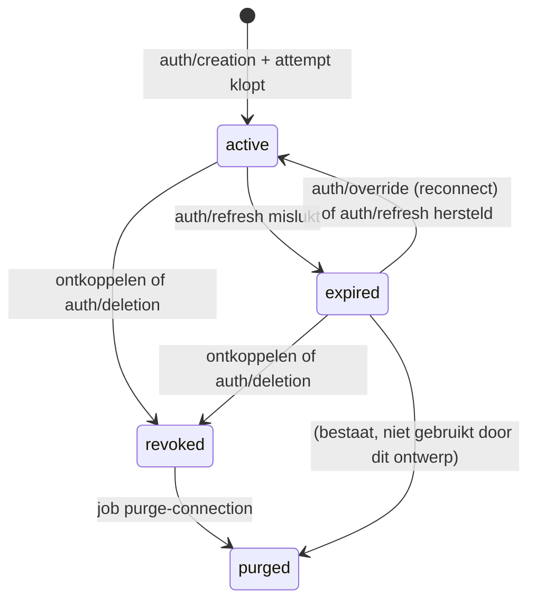

# Integraties: mail koppelen via Nango

Ontwerp voor sessie 4: Gmail en Outlook koppelen via Nango en nieuwe mail binnenhalen tot `events` + bron-inhoud. Geen AI en geen kaarten uit mail; dat is sessie 5.

**Status:** stap 1 van §10 gebouwd (Nango-basis); de rest is ontwerp. Staging gebruikt voorlopig Nango's testapps (#082). Beslissingen: #074–#083; de open vragen zijn beantwoord (§8, #080). Bouwt voort op #005, #008, #013, #020, #037, #038, #044, #051, #052 en #073 en op wat er in `packages/db` staat. Waar dit ontwerp daarvan afwijkt, staat dat in [§9](#9-afwijkingen-van-het-bestaande-ontwerp).

Inhoud:

0. [Bronnen en wat er in Nango staat](#0-bronnen-en-wat-er-in-nango-staat)
1. [De keten](#1-de-keten)
2. [Koppelen en tenant-toewijzing](#2-koppelen-en-tenant-toewijzing)
3. [Welke maildata, waar](#3-welke-maildata-waar)
4. [Betrouwbaarheid](#4-betrouwbaarheid)
5. [Levenscyclus van een connectie](#5-levenscyclus-van-een-connectie)
6. [Providers](#6-providers)
7. [Configuratie, keys en environments](#7-configuratie-keys-en-environments)
8. [Beantwoorde vragen](#8-beantwoorde-vragen)
9. [Afwijkingen van het bestaande ontwerp](#9-afwijkingen-van-het-bestaande-ontwerp)
10. [Bouwvolgorde](#10-bouwvolgorde)

---

## 0. Bronnen en wat er in Nango staat

### 0.1 Gebruikte bronnen (gelezen op 2026-10-05)

- **Docs MCP `nango-docs`** (`https://nango.dev/docs/mcp`), verbonden. Gelezen pagina's staan per onderwerp hieronder gelinkt.
- **Skill `building-nango-functions`** staat in `.agents/skills/building-nango-functions/` (via `npx skills add`, hash in `skills-lock.json`). Claude Code laadt skills alleen uit `.claude/skills/`, dus hij verscheen niet als skill; ik heb `SKILL.md` en `references/syncs.md` direct gelezen. Regels die het ontwerp sturen: checkpoint verplicht en gebruikt in de request, geen `syncType: 'incremental'`/`lastSyncDate`, geen `trackDeletes*` bij een changed-only checkpoint, `retries: 3` op elke provider-call, geen `endpoints`-veld (deprecated).
- **Versies:** Nango CLI `nango` 0.71.12 (lokaal geïnstalleerd onder Node 24 en gelijk aan npm `latest`), `@nangohq/frontend` 0.71.12, `@nangohq/node` 0.71.12.
- **Templates:** broncode van [`google-mail/syncs/messages.ts`](https://github.com/NangoHQ/integration-templates/blob/main/integrations/google-mail/syncs/messages.ts) (v1.0.2) en [`outlook/syncs/messages.ts`](https://github.com/NangoHQ/integration-templates/blob/main/integrations/outlook/syncs/messages.ts) (v1.1.1).

| Onderwerp | Bevinding | Gevolg | Bron |
|---|---|---|---|
| Connect session | Server maakt met een API key (scope `environment:connect_sessions:write`) een sessie van 30 minuten. `tags` gaan mee naar de connectie en naar de auth-webhooks. `end_user` en `organization` zijn **deprecated**, vervangen door `tags`. `allowed_integrations` beperkt de keuze. | Tags in plaats van end user/organisatie (§2). | [create session](https://nango.dev/docs/reference/backend/http-api/connect/sessions/create), [auth guide](https://nango.dev/docs/guides/auth/auth-guide) |
| Opnieuw koppelen | Aparte reconnect session (`POST /connect/sessions/reconnect`) voor een bestaande connectie; daarna auth-webhook `override`. Werkt alleen voor connecties die via een connect session zijn gemaakt. | §2.4. | [reconnect](https://nango.dev/docs/reference/backend/http-api/connect/sessions/reconnect) |
| Frontend | `@nangohq/frontend`: `openConnectUI({ onEvent })` + `setSessionToken()`; events `connect` en `close`. Of zonder SDK: de `connect_link` uit de sessie. | §2.1. | [frontend SDK](https://nango.dev/docs/reference/frontend/frontend-sdk) |
| Auth-webhooks | `type: "auth"`, `operation`: `creation`, `override`, `refresh` (mislukt met `success: false` + `error.type`; hersteld met `success: true`), `deletion` (alleen bij verwijderen via dashboard of API, niet bij bulk). Nango probeert een mislukte refresh periodiek opnieuw en geeft pas na "enkele dagen" op. | §5. | [webhooks from Nango](https://nango.dev/docs/guides/platform/webhooks-from-nango), [token refreshing](https://nango.dev/docs/guides/auth/token-refreshing) |
| Sync-webhooks | Na elke run: `success`, `modifiedAfter`, `responseResults` (aantallen), `checkpoints.from/to`; bij fout `error`. Bevatten geen records. Webhooks bij lege runs zijn uit te zetten. | Webhook is alleen een seintje (§4). | idem |
| Verificatie | Header `X-Nango-Hmac-Sha256` = HMAC-SHA256 (hex) over de ruwe body met de **webhook signing key** (Environment Settings → Webhooks), niet de API key. `X-Nango-Signature` is legacy. | Past op #020. | idem |
| Retries | **2 herhalingen** bij non-2xx, exponentieel vanaf 100 ms; timeout 20 s. Er zit geen delivery-ID in de payload. | Een korte storing bij ons = webhook kwijt: vangnet-job nodig (§4.3). | idem, [limits](https://nango.dev/docs/guides/platform/limits) |
| Webhook-URL's | **Twee URL's per environment** (primair + secundair), beide krijgen alles. Plus **`webhook_url_override` per connectie**, te zetten bij het aanmaken van de connect session; dan gaan de webhooks van die connectie **alleen** daarheen. Nango raadt dit zelf aan voor lokaal werken op een gedeeld environment. | Lokaal krijgt eigen webhooks zonder staging te raken (§7.4). | [webhooks from Nango](https://nango.dev/docs/guides/platform/webhooks-from-nango#override-webhook-urls-per-connection), [environments](https://nango.dev/docs/guides/platform/environments#engineering-collaboration) |
| Records | `GET /records` geeft een geordende stroom wijzigingen met per record `_nango_metadata` (`last_action` ADDED/UPDATED/DELETED, `deleted_at`, `cursor`). Cursor per connectie **en** model zelf bewaren. Kan dubbele records geven tijdens pagineren. `modified_after` bestaat ook, maar de cursor is de aanbevolen weg. | §4.2. | [records cache](https://nango.dev/docs/guides/functions/syncs/records-cache), [get records](https://nango.dev/docs/reference/backend/http-api/sync/records-list) |
| Verwijderde records | `batchDelete()` in de sync markeert een record als verwijderd (soft delete, laatste payload blijft). | §4.5. | [deletion detection](https://nango.dev/docs/guides/functions/syncs/deletion-detection) |
| Checkpoints | `getCheckpoint()`/`saveCheckpoint()` per pagina; handmatig opnieuw syncen met `reset` (en eventueel `emptyCache`). | Syncs in §3.2. | [checkpoints](https://nango.dev/docs/guides/functions/syncs/checkpoints) |
| Bewaren in Nango | Records versleuteld (AES-256-GCM). Payload weg na **30 dagen** zonder update, alles weg na **60 dagen** zonder sync-run. **Prune-endpoint** maakt payloads direct leeg (`environment:records:write`). Verwijderde connectie: meteen onbereikbaar, **na 31 dagen** hard verwijderd (incl. records). Logs **15 dagen**, zonder request/response-bodies. Audit trail 1 jaar. DPA geldt automatisch. Purge eerder kan via support. | AVG-punt (§3.5). | [security](https://nango.dev/docs/guides/platform/security), [prune records](https://nango.dev/docs/reference/backend/http-api/sync/prune-records) |
| Regio | De docs noemen **geen regio** voor Nango Cloud, alleen "managed PostgreSQL in AWS". De uitgaande IP's (`52.34.139.153`, `54.69.127.183`, …) zijn AWS-adressen die bij us-west-2 (Oregon) horen; dat is mijn afleiding, niet gedocumenteerd. EU-dataresidentie alleen via BYOC/self-hosting (Enterprise). | Nakijken in DPA/Trust Center (§3.5, todo). | [security](https://nango.dev/docs/guides/platform/security#network-access), [self-hosting](https://nango.dev/docs/guides/platform/self-hosting) |
| Functions als code | `nango init nango-integrations`; root-`index.ts` importeert elke function; `.nango/` committen; `dist/` negeren. Deploy: `nango deploy <env>` met `NANGO_SECRET_KEY_<ENV>`; deel-deploy met `--sync`/`--action`/`--integration`. CI: compile + tests op PR, deploy na merge, key met alleen `environment:deploy`. | §7.5. | [functions guide](https://nango.dev/docs/guides/functions/functions-guide), [CI/CD](https://nango.dev/docs/guides/functions/ci-cd) |
| Event functions | `validate-connection` (bij koppelen en opnieuw koppelen; gooien = weigeren), `post-connection-creation`, `pre-connection-deletion`. | Zelfde mailbox bij opnieuw koppelen (§2.4), token intrekken bij Google (§5.3). | [event functions](https://nango.dev/docs/guides/functions/event-functions) |
| API keys | Environment-keys met **scopes per key** (o.a. `connect_sessions:write`, `records:read`, `records:write`, `actions:execute`, `connections:delete`, `deploy`, `logs:read`). Account-keys alleen voor account-API's. Elk environment heeft een "Default - Full access"-key. | §7.3. | [API keys](https://nango.dev/docs/reference/backend/http-api/api-keys) |
| Limieten | API: 200 requests/min (free), 1.000 (pay-as-you-go). Minimale sync-frequentie 30 s. | Rate-limit bewaken in de ingest-job. | [limits](https://nango.dev/docs/guides/platform/limits) |
| Templates | Gmail `messages`: **hele mailbox** zonder tijdsgrens, `format=metadata` (dus **geen tekst**), history-API voor wijzigingen, scope `gmail.readonly`, elk uur. Outlook `messages`: één map (standaard inbox), 30 dagen terug, delta-links, **volledige `body` (HTML)**, scope `Mail.Read`, elk uur. Beide gebruiken nog het deprecated `endpoints`-veld. | Geen template gebruiken, eigen syncs met dezelfde technieken (§3.2). | template-broncode (links hierboven) |

### 0.2 Management MCP: wat ik zag (alleen lezen)

Gebruikt: `integrations_list`, `integrations_get` (met `webhook`), `connections_list`, `functions_list`, `providers_get`. Niet gebruikt: `connections_get` en alle schrijftools.

| Controle | Resultaat |
|---|---|
| Environment | `integrations_list` geeft alleen `github-getting-started` → **staging**, zoals verwacht. |
| Integraties | Alleen `github-getting-started` (GitHub, `forward_webhooks: true`, geen webhook-URL). **Er is nog geen Gmail- of Outlook-integratie.** |
| Connecties | Geen. |
| Functions | Geen (op `github-getting-started`). |
| Provider `google-mail` | OAuth2, `access_type=offline`, `prompt=consent`, proxy `gmail.googleapis.com`, `post_connection_script: googleMailPostConnection` (ingebouwd), webhook-routing via Pub/Sub. |
| Provider `outlook` | OAuth2 via `login.microsoftonline.com/common`, `default_scopes: offline_access, .default`, proxy `graph.microsoft.com`, webhook-routing voor Graph-subscriptions. |

**Wat ik via de MCP níet kon zien** (graag nakijken in het dashboard, zie docs/todo.md):

- de webhook-URL's (primair en secundair) en welke webhook-soorten aan staan;
- de webhook signing key;
- de callback-URL van het environment;
- de environments zelf (`staging`, `prod`) en of `prod` als production-environment gemarkeerd is (met een API key ziet de MCP er maar één);
- welke API keys er zijn en met welke scopes, ook die van de MCP zelf;
- de audit trail en het plan (rate limits, kosten per connectie/sync-run).

---

## 1. De keten

```mermaid
sequenceDiagram
    participant U as Gebruiker (web)
    participant A as api
    participant N as Nango
    participant P as Google / Microsoft
    participant W as worker
    participant DB as Postgres

    U->>A: connections.startConnect({ provider: 'gmail' })
    A->>DB: connect_attempts (tenant + user uit de sessie)
    A->>N: POST /connect/sessions (tags: tenant, user, attempt)
    A-->>U: session token
    U->>N: Connect UI (@nangohq/frontend)
    N->>P: OAuth (eigen client-id)
    P-->>N: tokens
    N->>N: validate-connection (event function)
    N->>A: webhook auth/creation (HMAC)
    A->>DB: resolve_connect_attempt() → tenant; webhook_deliveries
    A-->>N: 200
    A->>W: job nango-webhook {tenantId, deliveryId}
    W->>DB: connections (active) + attempt verbruikt + audit
    W->>N: action account-info → mailadres + account-ID
    N->>P: sync inbox-messages (elke 5 min)
    N->>A: webhook sync (HMAC)
    A->>DB: resolve_connection() → tenant; webhook_deliveries
    A->>W: job mail-ingest {tenantId, connectionId}
    W->>N: GET /records?cursor=…
    W->>DB: per pagina één tx: events + event_contents + event_entities + cursor
    W->>N: prune records tot de cursor
```

Stappen:

1. **Koppel** (web) → oRPC `connections.startConnect` (sessie vereist, #029).
2. **Connect session** (api): legt een `connect_attempt` vast met tenant en gebruiker uit de sessie en vraagt Nango om een sessie met die attempt in de tags (§2.2).
3. **Connect UI** (web): `@nangohq/frontend` opent de Nango-modal met het token; de gebruiker logt in bij Google of Microsoft.
4. **Auth-webhook `creation`** (api): handtekening, tenant via de attempt, `webhook_deliveries`, 200, job.
5. **Connectie actief** (worker): `createConnection()` (bestaat al) in dezelfde transactie als het verbruiken van de attempt; daarna het mailadres ophalen voor `account_label`.
6. **Nango-sync** draait elke 5 minuten (§3.2) en zet minimale records in Nango's cache.
7. **Sync-webhook** (api): `resolve_connection()`, `webhook_deliveries`, 200, job.
8. **Records ophalen** (worker, job `mail-ingest`): vanaf de cursor van deze connectie, pagina voor pagina.
9. **Normaliseren**: Zod-parse, tekst opschonen, adressen normaliseren.
10. **Events + bron-inhoud**: per pagina in één transactie `events` (`email.received`), `event_contents` (met `retain_until`), `event_entities` voor bekende adressen en de nieuwe cursor. Daarna Nango's kopie leegmaken (prune).

Een vangnet-job (§4.3) doet stap 8–10 ook zonder webhook, elke 10 minuten per actieve mailconnectie.

---

## 2. Koppelen en tenant-toewijzing

### 2.1 Connect session aanmaken (api)

oRPC-procedures (alle met sessie). Elke gebruiker mag zijn eigen mailbox koppelen; opnieuw koppelen en ontkoppelen mag degene die koppelde (`connected_by_user_id`) of een `owner` (§8, vraag 7):

| Procedure | Input | Doet |
|---|---|---|
| `connections.list` | – | Connecties van de tenant (provider, status, `account_label`, `last_synced_at`); nooit `nango_connection_id` of de nonce |
| `connections.startConnect` | `{ provider: 'gmail' \| 'outlook' }` | Attempt + connect session; geeft `{ sessionToken, attemptId }` |
| `connections.reconnect` | `{ connectionId }` | Reconnect session voor een eigen connectie (`active` of `expired`) |
| `connections.complete` | `{ attemptId }` | Vangnet als de creation-webhook niet aankwam (§2.3) |
| `connections.disconnect` | `{ connectionId }` | `disconnectConnection()` + job `purge-connection` (staat al in docs/todo.md) |

`startConnect`:

1. In `withTenant(tenantId uit de sessie)`: rij in `connect_attempts` (nieuw, §9) met `provider`, `nango_integration_id`, `created_by_user_id` (uit de sessie), `expires_at = now() + 30 min` en een `nonce` van 32 willekeurige bytes (`crypto.randomBytes`, hex). De nonce is het geheim van de flow; het `id` (UUIDv7, deels een tijdstempel) gaat nooit naar Nango.
2. `POST /connect/sessions` met:
   ```json
   {
     "tags": {
       "organization_id": "<tenantId>",
       "end_user_id": "<userId>",
       "connect_attempt": "<nonce>"
     },
     "allowed_integrations": ["<integratie-ID van de provider>"],
     "webhook_url_override": "<alleen lokaal, zie §7.4>"
   }
   ```
   Geen `end_user_email` en geen `end_user_display_name`: Nango toont dan ID's in plaats van namen, maar er gaan geen persoonsgegevens naar een extra subverwerker-veld (dataminimalisatie). `end_user` en `organization` gebruiken we niet, want die zijn deprecated.
3. Geeft het token terug. Het token is 30 minuten geldig en alleen bruikbaar voor deze ene flow; het mag naar de browser (zo is het bedoeld).

Frontend: `@nangohq/frontend` (0.71.12, enige dependency `@nangohq/types`, ±77 kB uitgepakt) met `openConnectUI({ onEvent })`. Op `connect` roept de web-app `connections.complete({ attemptId })` aan en toont "Koppeling wordt afgerond…" tot de connectie in `connections.list` staat. Alternatief zonder dependency: de `connect_link` in een popup openen; dan missen we de `connect`/`close`-events en moeten we pollen.

### 2.2 Een nieuwe Nango-connectie aan de tenant koppelen

Eis: nooit op basis van iets wat de frontend meestuurt; alleen op basis van wat onze server zelf aan Nango gaf, gecontroleerd via een geverifieerde webhook.

Gekozen: **de connect attempt is de sleutel, niet de tags zelf.**

1. De api zet de `nonce` van de attempt als tag `connect_attempt` op de connect session. Alleen onze server kan tags zetten: ze gaan mee in de server-side aanroep met de API key; de frontend-SDK heeft geen parameter voor tags ([frontend SDK](https://nango.dev/docs/reference/frontend/frontend-sdk), [tags](https://nango.dev/docs/guides/auth/connection-tags-configuration-metadata)). Dat toetsen we in de bouw ook zelf (§2.5).
2. Nango stuurt `auth/creation` met diezelfde tags, ondertekend met de signing key van het environment.
3. De api controleert de handtekening en zoekt de tenant op met een nieuwe `SECURITY DEFINER`-functie `resolve_connect_attempt(nonce) returns (tenant_id, attempt_id, provider)`, naar het voorbeeld van `resolve_connection()` (#038). De tenant komt dus **uit onze database**, niet uit `tags.organization_id` (dat staat er alleen voor het Nango-dashboard). Zo blijft de regel "tenant nooit uit de request-body" overeind.
4. De job verbruikt de attempt in `withTenant()`: `UPDATE connect_attempts SET consumed_at = now(), connection_id = … WHERE id = … AND consumed_at IS NULL AND created_at > now() - interval '1 day'`, in dezelfde transactie als `createConnection()`. Geen rij → niets aanmaken, loggen. Eenmalig en atomair, net als de nonce-regel in CLAUDE.md, maar transactioneel met het effect (een Redis-`GETDEL` vóór een mislukte transactie zou de attempt kwijtmaken).
5. Extra controles in de job: `providerConfigKey` hoort bij de `provider` van de attempt; `tags.organization_id` en `tags.end_user_id` zijn gelijk aan tenant en gebruiker van de attempt; de gebruiker is nog lid van de tenant (de FK `connected_by_user_id → member` dwingt dat ook af); `environment` in de payload is gelijk aan `NANGO_ENVIRONMENT`; `nango_connection_id` bestaat nog niet (uniek; een herhaalde levering doet niets).

Wordt geweigerd en alleen gelogd (met Nango-connectie-ID en integratie-ID, nooit tags of e-mail): geen `connect_attempt`-tag, onbekende attempt (bijvoorbeeld een connectie van de lokale omgeving die op staging binnenkomt, of een testconnectie uit het Nango-dashboard), verbruikte of verlopen attempt, andere provider. Antwoord altijd 200 (geen retries uitlokken). We verwijderen zo'n connectie **niet** bij Nango: op het gedeelde staging-environment kan hij van een andere omgeving zijn.

Waarom niet alleen de tags: `organization_id` in een ondertekende webhook is betrouwbaar zolang alleen wij sessies maken, maar de Management MCP (`connect_session_create`), het dashboard en een tweede omgeving op hetzelfde environment kunnen ook sessies maken. De attempt bewijst dat **deze** database de flow startte, voor **deze** tenant en gebruiker.

### 2.3 Als de creation-webhook niet aankomt

Nango probeert een webhook maar twee keer opnieuw, binnen een seconde. Valt dat samen met een deploy van de api, dan is hij weg. Daarom `connections.complete({ attemptId })`:

- De attempt moet bij de tenant **en** de gebruiker van de sessie horen en onverbruikt zijn (anders `NOT_FOUND`).
- De api zoekt bij Nango `GET /connections?tags[connect_attempt]=<nonce>` (op de tag die onze server zette, niet op een ID uit de browser) en zet bij precies één treffer met de juiste integratie dezelfde job in als de webhook.
- Vraagt de scope `environment:connections:list` voor de api-key. Nango raadt die scope af voor backends (lekt de key, dan zijn connecties op te sommen); gekozen omdat de frontend dan niets aanlevert (§8, vraag 3). Niet gekozen: de `connectionId` uit het `connect`-event van de Connect UI als opzoeksleutel gebruiken en server-side met `GET /connections/{id}` (`connections:read`) de tag controleren.

Sluit de gebruiker het venster vóór `complete` en is de webhook ook weg, dan vangt de sweep het op: elke 10 minuten zoekt hij voor onverbruikte attempts tussen 30 minuten en 1 dag oud op dezelfde manier bij Nango (§4.6). Attempts ouder dan 1 dag ruimt de retentie-job op; vindt hij dan toch nog een Nango-connectie met die nonce, dan verwijdert hij die bij Nango (hij is aantoonbaar van ons en is nooit aan een tenant gekoppeld), zodat er geen mailbox in Nango blijft syncen zonder eigenaar.

### 2.4 Opnieuw koppelen en twee mailboxen

**Opnieuw koppelen** (`expired` → `active`, #044): de kaart "Koppeling vernieuwen" of de knop bij de koppeling roept `connections.reconnect({ connectionId })` aan. De api controleert in `withTenant()` dat de connectie bestaat (RLS) en `expired` of `active` is, en maakt een reconnect session voor die `nango_connection_id`. Nango stuurt daarna `auth/override`; de job doet via `resolve_connection()` `expired → active` met reden `reauthorized` en sluit de open `connection_problem`-kaart. Bij `active` alleen een audit-regel. `revoked` en `purged` zijn eindstatussen (#044): daar is opnieuw koppelen een nieuwe connectie.

**Ander account bij opnieuw koppelen:** een reconnect kan met een ander Google- of Microsoft-account inloggen; de connectie zou dan ongemerkt een andere mailbox lezen. Daarom een event function `validate-connection` per provider: bij de eerste koppeling slaat hij het provider-account-ID op in de connectie-metadata (Gmail: hash van `emailAddress` uit `users/me/profile`; Outlook: `id` uit `/me`), bij een reconnect weigert hij een ander account. Nango zet de connectie dan op een auth-fout en de gebruiker ziet in de Connect UI dat het mislukte. Dit patroon staat zo in de Nango-docs.

Tweede laag, in onze eigen code: na elke `override` en elk herstel roept de worker `account-info` opnieuw aan en vergelijkt het resultaat met `external_account_id`. Wijkt het af, dan gaat de connectie naar `expired` (reden `account_mismatch`, nieuw), komt er een kaart, en haalt de ingest niets meer op. Zo leest een connectie nooit een andere mailbox dan bij het koppelen, ook als de Nango-function ontbreekt of faalt.

**Twee mailboxen in één tenant** (bijv. `info@` en `jan@`): twee connecties, elk met een eigen attempt, cursor en `account_label`. De bestaande partiële unique `(tenant_id, provider, external_account_id) where status = 'active'` voorkomt dat dezelfde mailbox twee keer actief gekoppeld wordt. Botst de nieuwe connectie daarop, dan maakt de job geen tweede connectie, verwijdert hij de nieuwe Nango-connectie (die is aantoonbaar van ons: de attempt klopt) en zet hij `connect_attempts.failure_code = 'duplicate_account'`; de web-app toont "Deze mailbox is al gekoppeld". Een mail die in beide mailboxen binnenkomt (cc aan beide) wordt twee events, één per mailbox; dat blijft zo (§8, vraag 5).

`external_account_id` en `account_label` komen uit een kleine Nango-action `account-info` (alleen lezen: Gmail `users/me/profile`, Graph `/me?$select=id,mail,userPrincipalName`), die de worker direct na het aanmaken aanroept. Dat is geen schrijfactie naar buiten, dus geen actiepijplijn (CLAUDE.md, Acties).

### 2.5 Kan een mailbox bij een andere tenant terechtkomen?

Nee. Elke route waarlangs een connectie aan een tenant komt, en waarom dat niet de verkeerde tenant kan zijn:

| Route | Wie bepaalt de tenant | Waarom niet een andere tenant |
|---|---|---|
| Nieuwe koppeling (`startConnect`) | de sessie (`activeOrganizationId`) | De browser geeft alleen een provider mee. Een gebruiker kan alleen een tenant kiezen waarvan hij lid is (Better Auth, #030) |
| Webhook `auth/creation` | `resolve_connect_attempt(nonce)` in onze database | De nonce is 256 bits willekeurig, alleen bekend bij onze server en Nango, eenmalig en na een dag ongeldig. Tags kan alleen onze server zetten. Daarnaast moeten tags, provider en lidmaatschap kloppen (§2.2 stap 5) |
| Vangnet `complete({ attemptId })` | de sessie | De attempt moet bij de tenant **en** de gebruiker van de sessie horen; de connectie wordt bij Nango opgezocht op de nonce die onze server zette, niet op iets uit de browser |
| Sweep voor attempts | de attempt-rij | Zelfde opzoeking op de nonce, binnen `withTenant()` van de attempt |
| Opnieuw koppelen (`reconnect`) | de sessie + RLS | Een `connectionId` van een andere tenant geeft `NOT_FOUND`. Een ander account in de reconnect: geweigerd door `validate-connection` en daarna nog door onze accountcontrole (§2.4) |
| Webhooks `override`, `refresh`, `deletion`, `sync` | `resolve_connection(provider, nango_connection_id)` | Wijzigen alleen de status of data van de connectie die al bij die tenant hoort; maken nooit een nieuwe koppeling |
| Vervalste webhook | – | Zonder de signing key geen geldige `X-Nango-Hmac-Sha256` → 401 |
| Andere omgeving op `staging` (lokaal), dashboard, MCP | – | Hun attempts en connecties bestaan niet in deze database → loggen en negeren |
| `connectionId` meegeven aan `nango.auth()` in de browser | – | De frontend-SDK heeft die parameter. Wij sturen `nango_connection_id` nooit naar de browser (Nango-ID's zijn willekeurige UUID's), en al zou iemand er een raden: een `override` op een vreemde connectie faalt op de accountcontrole (§2.4) en levert geen nieuwe koppeling op |

Tests in de bouw (CLAUDE.md: elke route krijgt een isolatietest): webhook met de nonce van tenant A en tags van tenant B → geweigerd; `complete` met een attempt van een andere tenant of gebruiker → `NOT_FOUND`; `reconnect` op een connectie van een andere tenant → `NOT_FOUND`; `override` met een ander account → `expired`, geen ingest; een connect session aanmaken en in de browser `nango.auth()` met een bestaande `connectionId` en extra `params` proberen → geen wijziging aan die connectie (handmatige test op staging, vastgelegd in de PR).

Wat ons ontwerp **niet** tegenhoudt, omdat het geen lek is: iemand die zelf kan inloggen op een mailbox, kan die koppelen in elke tenant waarvan hij lid is. Dat is toestemming van de eigenaar van die mailbox bij Google of Microsoft, net als het instellen van doorsturen. Wil je dat dezelfde mailbox nooit in twee tenants tegelijk actief is, dan kan dat met een globale controle op `external_account_id` (een smalle `SECURITY DEFINER`-functie). Nadeel: de foutmelding verraadt dat die mailbox al bij een ander bedrijf gekoppeld is. Niet in het ontwerp; zie de vraag in de PR.

---

## 3. Welke maildata, waar

### 3.1 Wat de sync ophaalt

Eén record per mail, model `InboxMessage`, zo klein mogelijk:

| Veld | Gmail | Outlook (Graph) | Waarom |
|---|---|---|---|
| `id` | `message.id` | `message.id` | Sleutel bij de provider → `events.external_id` |
| `threadId` | `threadId` | `conversationId` | `events.thread_key`, kaarten per gesprek (sessie 5) |
| `internetMessageId` | header `Message-ID` | `internetMessageId` | Antwoorden later (`In-Reply-To`/`References`) |
| `receivedAt` | `internalDate` | `receivedDateTime` | `events.occurred_at` |
| `from` | header `From` (adres + naam) | `from.emailAddress` | Afzender, koppelen aan contacten |
| `to`, `cc` | headers `To`, `Cc` (alleen adressen) | `toRecipients`, `ccRecipients` (alleen adressen) | Ontvangers; antwoorden aan allen later |
| `subject` | header `Subject` | `subject` | |
| `bodyText` | `text/plain`-deel; zonder dat het HTML-deel omgezet naar tekst; max. 32.000 tekens | body met `Prefer: outlook.body-content-type="text"` (Graph levert dan tekst); max. 32.000 tekens | Inhoud voor de AI (sessie 5) |
| `labels` | systeemlabels uit een vaste lijst: `INBOX`, `UNREAD`, `IMPORTANT`, `STARRED`, `CATEGORY_PERSONAL`, `CATEGORY_UPDATES`, `CATEGORY_FORUMS` | `inbox`, plus `isRead` als `UNREAD` | "label/map"; geen namen van eigen labels |
| `attachments` | per deel met `filename`: naam, `mimeType`, `body.size`, `attachmentId` | `GET /messages/{id}/attachments?$select=id,name,contentType,size` (alleen als `hasAttachments`) | Alleen metadata |
| `backfill` | `true` tijdens de eerste sync | idem | Sessie 5 kan oude mail anders behandelen |

Niet ophalen of opslaan, nergens (ook niet in Nango):

- **bijlagen zelf** (alleen naam, type, grootte en het ID om ze later bij de provider op te vragen);
- **volledige HTML** en andere MIME-delen; ingesloten afbeeldingen;
- **headers** buiten `From`, `To`, `Cc`, `Subject`, `Message-ID`, `Date`;
- **mail buiten de inbox**: verzonden, archief, concepten, eigen mappen;
- **spam en prullenbak** (Gmail `SPAM`/`TRASH`, Outlook "Ongewenste e-mail"/"Verwijderde items": niet in de inbox);
- **Gmail-categorieën Promoties en Sociaal** (`CATEGORY_PROMOTIONS`, `CATEGORY_SOCIAL`); Updates en Forums wel (facturen en notificaties van leveranciers vallen daar vaak onder);
- namen van ontvangers, eigen labelnamen, `snippet`/`bodyPreview` (dubbel met de tekst), `webLink`, `importance`.

Opschonen van quotes en handtekeningen (data-model, `event_contents.body_text`) gebeurt in **onze** normalisatiecode, met fixtures getest, niet in de Nango-function: dan is het te testen zonder deploy, en Nango's kopie leeft toch maar minuten (§3.5).

**Afgedwongen, niet alleen afgesproken.** Bijlagen en HTML komen nergens terecht, ook niet per ongeluk:

- **In de Nango-function:** het recordmodel is een strikt Zod-object met alleen de velden hierboven; `batchSave()` valideert ertegen. Gmail levert met `format=full` de HTML en kleine inline delen wel aan de function (in het geheugen, niet opgeslagen); de function neemt alleen het `text/plain`-deel of zet HTML om naar tekst. Bijlagen haalt hij nooit op (`attachments.get` wordt niet aangeroepen); van Outlook vraagt hij alleen `id,name,contentType,size`.
- **In de app:** `inboxMessageSchema` in `packages/integrations` is `strictObject`; een record met een onbekend veld (zoals `html`, `payload` of `contentBytes`) wordt geweigerd en gelogd met alleen het record-ID. `event_contents.body_text` en `subject` gaan door een check die resterende tags (`<…>`) en base64-blokken eruit haalt.
- **In de database:** `event_contents` heeft geen kolom voor HTML of bestanden; `attachments` is `attachmentMetaSchema[]` (naam, type, grootte, ID).
- **Tests:** fixtures met een HTML-only mail, een mail met bijlage en een mail met inline-afbeelding; de test eist dat het record en de rijen geen `<html`, geen `<`-tags en geen base64 van de bijlage bevatten.
- **Logs:** records worden nooit gelogd, alleen ID's (CLAUDE.md, Logging). Nango logt van provider-calls alleen URL, methode, status en headers, nooit bodies.

### 3.2 De syncs (eigen functions, geen templates)

Sync Strategy Gate uit de skill:

**`gmail` / `inbox-messages`**
- Change source: Gmail History API (`users.history.list` met `startHistoryId`), zoals het template.
- Checkpoint: `{ phase: 'backfill' | 'history', historyId, pageToken }`.
- Backfill: `users.messages.list` met `q = "in:inbox newer_than:14d -category:promotions -category:social"`, per bericht `messages.get?format=full`, daarna in de function terugbrengen tot het model hierboven. `historyId` van het profiel vóór de backfill bewaren (zoals het template), dan mist de overstap naar history niets.
- Incrementeel: history met `historyTypes = messageAdded, labelAdded, labelRemoved, messageDeleted`. Een bericht komt in de cache als het `INBOX` heeft en geen `SPAM`, `TRASH`, `CATEGORY_PROMOTIONS` of `CATEGORY_SOCIAL`. Een bericht dat naar de prullenbak of spam gaat, of definitief verwijderd wordt → `batchDelete()`. Uit de inbox gearchiveerd → niets (de mail bestaat nog).
- `historyId` te oud (404) → opnieuw backfill van 14 dagen, net als het template; dubbele berichten vangen we op bij het opnemen (§4.4).
- Deletes: expliciet uit de history (`messagesDeleted`, `labelAdded: TRASH/SPAM`), geen `trackDeletes*` (dat mag niet bij een changed-only checkpoint).
- Frequentie: elke 5 minuten. Realtime via Pub/Sub (Nango ondersteunt het) later.

**`outlook` / `inbox-messages`**
- Change source: Graph delta query op `/me/mailFolders/inbox/messages/delta`, zoals het template.
- Checkpoint: `{ deltaLink | nextLink }`.
- Eerste keer: `$filter=receivedDateTime ge <nu − 14 dagen>`, `$select` met alleen de velden uit §3.1, header `Prefer: outlook.body-content-type="text"`.
- Deletes: `@removed` in de delta. Graph meldt zo ook berichten die alleen uit de inbox verplaatst zijn (archiveren). De function controleert per `@removed` met `GET /me/messages/{id}?$select=parentFolderId`: 404 of de map "Verwijderde items" → `batchDelete()`; een andere map → niets. Dit gedrag leggen we eerst vast met een echte payload als fixture (CLAUDE.md, Integraties), want de Graph-docs zijn er niet eenduidig over.
- Frequentie: elke 5 minuten. Realtime via Graph-subscriptions later.

Beide: `retries: 3` per provider-call, geen `endpoints`-veld, `autoStart: true` (geen metadata nodig), 14 dagen als constante in de function (een andere termijn is een nieuwe versie). Elke function met fixture-tests (`nango dryrun --save` met Daniëls eigen mailbox op staging, daarna geanonimiseerd, #073).

### 3.3 Hoe ver terug

**14 dagen** bij de eerste sync (voorstel van Daniël). Genoeg om lopende offerteaanvragen te zien zonder een hele mailbox naar Nango en naar ons te kopiëren. Records uit de backfill krijgen `backfill: true`, zodat sessie 5 kan kiezen om daar geen kaarten voor te maken of ze anders te tonen.

### 3.4 Wat in `events` en wat in `event_contents`

Volgens docs/data-model.md (`events`, `event_contents`, §6.1 stap 2):

| Tabel | Kolom | Waarde |
|---|---|---|
| `events` | `connection_id`, `source` | de connectie; `gmail` of `outlook` |
| | `external_id` | provider-`id` van de mail |
| | `type` | `email.received` |
| | `occurred_at` | `receivedAt` |
| | `thread_key` | `threadId` |
| | `payload` | `{ attachmentCount, labels, backfill }`, alleen getallen, booleans en waarden uit vaste lijsten (geen vrije tekst, zoals nu afgedwongen) |
| | `summary` | leeg; komt in sessie 5 |
| `event_contents` | `from_address`, `to_addresses` | genormaliseerd (kleine letters) |
| | `subject`, `body_text` | tekst, opgeschoond |
| | `attachments` | `[{ name, mimeType, size, providerAttachmentId }]` (bestaand `attachmentMetaSchema`) |
| | `retain_until` | `occurred_at` + `tenant_settings.content_retention_days` (nu 90; open vraag 3 in data-model) |
| `event_entities` | | afzender en ontvangers die al een `entity_identifier` hebben, `linked_by = 'rule'`; geen nieuwe entiteiten (§6.1 stap 2) |

Nieuw nodig (§9): `event_contents.cc_addresses` (P) en `event_contents.from_name` (P). Zonder cc kan "antwoord aan allen" later niet; de naam van de afzender is in sessie 5 nodig om een contact aan te maken. Alternatief: cc in `to_addresses` mengen (verliest informatie) of de naam niet opslaan (dan moet de AI hem uit de handtekening halen).

### 3.5 Wat er in Nango blijft (AVG)

| Wat | Waar in Nango | Hoe lang | Beperken |
|---|---|---|---|
| OAuth-tokens, scopes | connectie | tot we de connectie verwijderen; daarna 31 dagen soft-deleted | Ontkoppelen verwijdert hem (§5.3); eerder purgen via Nango-support |
| Connectie-metadata | connectie | idem | Alleen account-ID-hash (§2.4) en tags met UUID's, geen e-mail of namen |
| Sync-records (mailinhoud) | records cache | volgens Nango 30 dagen payload / 60 dagen alles | **Wij prunen direct na het opnemen** (`POST /records/prune` tot de cursor): de payload staat dan minuten in Nango, niet dagen. Bij ontkoppelen: 31 dagen tot hard delete (alleen nog lege payloads als het prunen gelukt is) |
| Logs | Nango-logs | 15 dagen | Geen bodies; wel URL's van provider-calls (bericht-ID's, geen inhoud) |
| Audit trail | account | 1 jaar | Alleen beheeracties |

**Voor de subverwerkerslijst:** Nango (Nango Inc., VS) verwerkt OAuth-tokens van de mailbox en, kortstondig, de inhoud van inkomende mail (afzender, ontvangers, onderwerp, tekst, bijlagenamen) van de klant én van derden die de klant mailen. Opslag in AWS; regio niet gedocumenteerd (vermoedelijk VS, us-west-2). DPA is van toepassing op alle cloud-accounts ([nango.dev/terms#dpa](https://nango.dev/terms#dpa)); na te gaan: doorgiftegrondslag (SCC's of Data Privacy Framework), regio, subverwerkers van Nango. Dit is het punt uit #005 ("herzien na pilotgesprekken over EU-hosting").

**Uitleg voor een klant die ernaar vraagt** (na het nagaan van de regio de plek invullen):

> Voor het koppelen van je mailbox gebruiken we Nango, een gespecialiseerde dienst voor koppelingen met onder meer Google en Microsoft. Nango bewaart de sleutel waarmee EffectiefAI je mailbox mag lezen. Je wachtwoord ziet Nango niet en wij ook niet. Die sleutel blijft bestaan zolang je de koppeling gebruikt.
>
> Nieuwe mail gaat via Nango naar EffectiefAI. Bij Nango staat de inhoud daarna nog maar enkele minuten: zodra wij hem hebben opgeslagen, wissen we hem daar. Lukt dat wissen een keer niet, dan ruimt Nango het zelf op na uiterlijk 30 dagen. Bijlagen en de opmaak van mails gaan niet via Nango en worden nergens opgeslagen, alleen de naam en grootte van een bijlage.
>
> Nango houdt technische logboeken bij, 15 dagen, zonder de inhoud van je mail.
>
> Ontkoppel je je mailbox, dan trekken we de toegang meteen in. Nango verwijdert alles definitief binnen 31 dagen; bij Google trekken we de toestemming ook direct in. Bij EffectiefAI verwijderen we dan de mail die via die koppeling binnenkwam.
>
> Nango versleutelt deze gegevens, is SOC 2 Type II-gecertificeerd en heeft met ons een verwerkersovereenkomst. De gegevens staan bij Amazon Web Services in [regio].

Wat de klant niet hoort maar wij wel moeten weten: na het wissen houdt Nango per mail een ID en een hash van de oude inhoud (om wijzigingen te herkennen), tot 60 dagen nadat de sync stopt of 31 dagen na het ontkoppelen. Daar staat geen leesbare inhoud in.

Niet gekozen (§8, vraag 4), maar mogelijk als het later nodig blijkt: de sync alleen metadata laten ophalen (ID, afzender, onderwerp) en de tekst in de worker via de Nango-proxy direct bij de provider ophalen. Dan staat er geen mailtekst in Nango's cache, maar gaat de tekst nog steeds door Nango's proxy (niet gelogd), krijgt de worker de brede scope `environment:proxy` en wordt de ingest complexer.

---

## 4. Betrouwbaarheid

### 4.1 De webhook-route

`POST /webhooks/nango` in `registerWebhookRoutes()` (#020), `auth: 'hmac'`:

1. **Verify** op de ruwe `Buffer`: HMAC-SHA256 met `NANGO_WEBHOOK_SIGNING_KEY`, hex, vergelijken met `crypto.timingSafeEqual`. Ontbreekt of klopt niet → 401. Geen SDK nodig.
2. **Parse** met Zod (`nangoWebhookSchema`, gediscrimineerd op `type`/`operation`). Onbekend type → 200 en negeren (Nango voegt types toe, docs). Ongeldige body na een geldige handtekening → 400 en loggen.
3. **`environment`** moet gelijk zijn aan `NANGO_ENVIRONMENT` (zonder hoofdlettergevoeligheid); anders 200, loggen als fout, niet verwerken. Sync-webhooks hebben geen `environment` (Nango-docs); daar geldt alleen de tenant-opzoeking.
4. **Tenant opzoeken**: `creation` via `resolve_connect_attempt()`, de rest via `resolve_connection(provider, nango_connection_id)` (#038). Onbekend → 200 en loggen met ID's (data-model §6.1 stap 1). Zo negeert staging de connecties van lokaal.
5. **Opslaan** in `webhook_deliveries` (`on conflict do nothing`), `delivery_id` zie §4.4.
6. **Job** in de queue `nango-webhook` met `{ tenantId, deliveryId }`.
7. **200** binnen enkele milliseconden (Nango's timeout is 20 s).

De job verwerkt per soort (alles binnen `withTenant()`, effect en `webhook_deliveries.status = processed` in één transactie):

| Soort | Effect |
|---|---|
| `auth/creation` | §2.2: connectie aanmaken, attempt verbruiken, daarna `account-info` |
| `auth/override` | §2.4: `expired → active` (`reauthorized`), kaart sluiten |
| `auth/refresh` mislukt | §5.1: `active → expired` (`invalid_grant`) + kaart |
| `auth/refresh` hersteld | §5.1: `expired → active` (`auth_recovered`, nieuw), kaart sluiten |
| `auth/deletion` | §5.2: `active`/`expired → revoked` (`provider_revoked`) + `purge-connection` |
| `sync` gelukt | job `mail-ingest` voor de connectie |
| `sync` mislukt | loggen met `error.type`; geen statuswijziging (een auth-probleem komt via `auth/refresh`); de vangnet-job probeert het later |

Een mislukte verwerking wordt herhaald (standaard jobopties, 5 pogingen); daarna `failed` met `last_error_code`, Sentry-melding, en hij blijft staan (data-model: een fout verdwijnt nooit stil).

### 4.2 Records ophalen: job `mail-ingest`

Queue `mail-ingest`, payload `{ tenantId, connectionId }`, één wachtende job per connectie (BullMQ-deduplicatie op `ingest:<connectionId>`), zodat webhook en vangnet niet dubbel werken.

1. `withTenant()`: connectie laden; niet `active` → klaar.
2. Cursorrij lezen met `FOR UPDATE` (nieuwe tabel `sync_cursors`, §9): één ingest tegelijk per connectie, ook bij twee workers.
3. `GET /records?model=InboxMessage&cursor=<cursor>&limit=100` (headers `Provider-Config-Key`, `Connection-Id`). **Geen databasetransactie open tijdens de Nango-call**: per pagina eerst ophalen, dan één korte transactie.
4. Per pagina, in één transactie: elk record met Zod parsen; nieuw of gewijzigd → `recordEvent()` (+ inhoud + koppelingen), verwijderd → §4.5; cursor = `_nango_metadata.cursor` van het laatste record; `connections.last_synced_at`.
5. Tot `next_cursor` leeg is. Daarna `POST /records/prune` met `until_cursor` = de opgeslagen cursor (buiten de transactie; idempotent, dus een mislukte prune gaat bij de volgende run mee).
6. Een record dat niet door Zod komt: loggen met record-ID, de rest van de pagina gaat door, cursor schuift door, teller in de audit. Een kapotte mail mag de connectie niet blokkeren; de fixture-tests moeten zulke gevallen vangen.

### 4.3 Vangnet-job

Nango probeert een webhook maar 2 keer opnieuw, binnen een seconde. Daarom: queue `mail-ingest`, herhaalde job `sweep` **elke 10 minuten** (BullMQ job scheduler), zelfde patroon als de retentie-sweep (#052): `list_tenant_ids()`, per tenant de actieve mailconnecties, per connectie een `mail-ingest`-job (gededupliceerd). Een gemiste sync-webhook kost zo hooguit 10 minuten vertraging. Dezelfde sweep vangt ook gemiste auth-webhooks op (§4.6).

- Lokaal is dit de gewone weg als er geen tunnel draait (§7.4).
- Het interval is een constante; een ander interval per omgeving hoeft niet (lokaal kan een ontwikkelaar de job handmatig starten via een script).
- Rate limit: een sweep kost bij weinig tenants een handvol Nango-requests; bij groei telt het mee tegen de 200/1.000 per minuut (§0.1). Dan alleen connecties pollen zonder webhook in de laatste 10 minuten.

### 4.4 Dubbel en idempotent

- **Records:** `events` is uniek op `(tenant_id, source, external_id)`; `recordEvent()` doet `on conflict do nothing` en raakt bestaande inhoud niet. Een record dat opnieuw langskomt (Nango meldt het bij elke labelwijziging als `UPDATED`, of de records-stroom geeft het twee keer tijdens pagineren) levert dus één event. `event_contents` alleen bij `created: true`.
- **Webhooks:** Nango stuurt geen delivery-ID. `delivery_id` = sha256 van de ruwe body voor sync-webhooks (uniek per run door `modifiedAfter`/`startedAt`). Voor auth-webhooks sha256 van de body plus het uur van ontvangst: een tweede `refresh`-fout drie weken later heeft precies dezelfde body en moet wél verwerkt worden, terwijl Nango's herhalingen binnen een seconde vallen. (Valt een herhaling toevallig over de uurgrens, dan verwerken we hem twee keer; de verwerking is idempotent, want de statusovergang vindt dan geen rij met de verwachte status.)
- **Jobs:** BullMQ-job-ID's per delivery (`nango-webhook-<deliveryId>`) en deduplicatie per connectie voor ingest.

### 4.5 Verwijderde mail bij de bron

Voorstel: **de bron-inhoud direct verwijderen, het event laten staan.**

- Een record met `_nango_metadata.deleted_at` (de sync zet dat alleen bij prullenbak, spam of definitief verwijderen; §3.2) → `event_contents` van dat event verwijderen, in dezelfde transactie als de cursor. Eén audit-regel per pagina met het aantal (`mail.content_removed`, nieuw).
- `events` blijft (append-only tijdlijn, zonder inhoud; `summary` blijft als die er al is). Wat er met een open kaart over zo'n mail gebeurt, is sessie 5 (voorstel: kaart `expired`).
- Archiveren (uit de inbox, mail bestaat nog) verandert niets.
- Waarom: de gebruiker gooide de mail weg, vaak omdat het spam of ongewenst was; dan willen we de tekst niet 90 dagen bewaren. Het event zelf bevat geen persoonsgegevens behalve de latere samenvatting.

### 4.6 Als een webhook wegvalt

Nango probeert een webhook 2 keer opnieuw, binnen een seconde (§0.1). Een deploy, een herstart of een storing bij ons is genoeg om er een te missen. Daarom mag **geen enkele** webhook nodig zijn om uiteindelijk de juiste toestand te bereiken; de webhook maakt het alleen sneller. De sweep in de queue `mail-ingest` (elke 10 minuten, fan-out per tenant, §4.3) doet drie dingen:

| Gemiste webhook | Gevolg zonder vangnet | Vangnet in de sweep | Uiterlijk hersteld na |
|---|---|---|---|
| `sync` | Nieuwe mail komt niet binnen | `mail-ingest` voor elke actieve mailconnectie: records vanaf de eigen cursor | 10 minuten |
| `auth/creation` | Mailbox gekoppeld bij Nango, niet bij ons; Nango synct zonder eigenaar | Onverbruikte attempts tussen 30 minuten en 1 dag oud: bij Nango zoeken op de nonce en koppelen zoals bij de webhook (§2.3). Na 1 dag: de Nango-connectie verwijderen | 10 minuten (of direct via `complete`) |
| `auth/refresh` mislukt | Connectie blijft `active`, er komt geen mail meer, de gebruiker weet van niets | Gezondheidscontrole: één keer per uur per actieve of verlopen connectie `GET /connections/{id}`. Antwoord `invalid_credentials` → zelfde afhandeling als de webhook (§5.1) | 1 uur |
| `auth/refresh` hersteld, `auth/override` | Connectie blijft `expired`, terwijl hij weer werkt | Dezelfde controle: `expired` en gezond → accountcontrole (§2.4) → `active` | 1 uur |
| `auth/deletion` | Wij denken dat de koppeling bestaat | Dezelfde controle: 404 → `revoked` + `purge-connection` (§5.2) | 1 uur |

- De gezondheidscontrole vraagt de scope `environment:connections:read` voor de worker-key (zonder `read_credentials`: geen tokens).
- Een webhook die wél aankwam maar waarvan de verwerking faalt, blijft als `failed` in `webhook_deliveries` staan, met retries en een Sentry-melding (§4.1). De sweep doet daarnaast toch zijn werk; beide paden zijn idempotent (unieke events, statusovergangen met `WHERE status = <verwacht>`).
- Valt de sweep zelf weg (worker of Redis plat): BullMQ registreert de job scheduler opnieuw bij het starten van de worker, en Sentry meldt een worker die niet start. Een monitor die alarm slaat als de laatste geslaagde sweep ouder is dan 30 minuten (Sentry Crons) komt in de bouw-PR van de ingest.
- Records in Nango blijven 30 dagen staan als wij ze niet ophalen, dus ook een storing van dagen kost geen mail.

---

## 5. Levenscyclus van een connectie

Statussen en overgangen uit CLAUDE.md en #044: `active → revoked | expired`, `expired → active | revoked | purged`, `revoked → purged`.



### 5.1 Token vernieuwen mislukt

- `auth/refresh` met `success: false` → in één transactie: `active → expired`, reden `invalid_grant`, en een kaart `connection_problem` (bestaat al; `dedupe_key = connection:<id>`, payload `{ reason }`). Tekst zonder AI: "De koppeling met je mailbox werkt niet meer. Koppel opnieuw om nieuwe mail te blijven zien." met de knop "Koppeling vernieuwen" (reconnect, §2.4).
- **Niet blijven retryen:** `mail-ingest` en de vangnet-job slaan `expired` over. Nango zelf probeert de refresh nog periodiek; lukt dat (tijdelijke storing bij Google/Microsoft), dan stuurt Nango `refresh` met `success: true` → `expired → active` met de nieuwe reden `auth_recovered`, kaart dicht, en de vangnet-job haalt de achterstand in.
- We maken geen onderscheid tussen een tijdelijke storing en een ingetrokken toestemming: Nango's `error.type` is niet gedocumenteerd als vaste lijst. Dus altijd `expired` (herstelbaar), nooit `revoked`. De `error.description` loggen we niet (kan provider-tekst bevatten), alleen `error.type`.
- De bestaande route via de actiepijplijn (`auth_expired` bij uitvoeren → `expired` + kaart, #051) blijft; beide gebruiken dezelfde kaart-dedupe.

### 5.2 Verwijderd in Nango

`auth/deletion` (iemand verwijderde de connectie in het Nango-dashboard of via de API): `active`/`expired → revoked` (reden `provider_revoked`) en job `purge-connection`. Is hij al `revoked` (wij ontkoppelden zelf), dan niets.

### 5.3 Ontkoppelen

Gebruiker klikt "Ontkoppelen" → `connections.disconnect` (owner, met bevestiging; procedure staat al in docs/todo.md):

1. `disconnectConnection()` (bestaat): `→ revoked`, reden `user_disconnected`, audit.
2. Job `purge-connection` (bestaat), met één nieuwe eerste stap:
   1. **Bij Nango verwijderen:** `DELETE /connections/{id}?provider_config_key=…` (scope `connections:delete`). 404 = al weg = goed. Mislukt het, dan retryt de job en wordt er nog niets gepurged. Nango stopt meteen de syncs en verwijdert alles na 31 dagen.
   2. Vóór dat verwijderen draait bij Nango de event function **`pre-connection-deletion`**:
      - **Gmail:** `POST https://oauth2.googleapis.com/revoke?token=<refresh token>` trekt de toestemming bij Google in (de gebruiker ziet de app daarna niet meer in zijn Google-account). Het token blijft binnen Nango; onze code ziet het nooit. Mislukt het intrekken, dan logt de function en gaat het verwijderen door (een gooiende cleanup-function blokkeert het verwijderen niet volgens de docs; te verifiëren in de bouw).
      - **Outlook:** Microsoft heeft geen endpoint waarmee een app zijn eigen gedelegeerde toestemming voor één gebruiker intrekt zonder admin-rechten (`oauth2PermissionGrant` verwijderen vraagt `DelegatedPermissionGrant.ReadWrite.All`; `revokeSignInSessions` logt de gebruiker overal uit). Dat is mijn kennis van Graph, nog te verifiëren in de Microsoft-docs. Dus: tokens verdwijnen bij Nango, en de bevestiging in de app zegt "Wil je de toegang ook bij Microsoft weghalen? Ga naar myapps.microsoft.com (werk) of account.live.com/consent/Manage (persoonlijk)".
   3. `purgeConnection()` (bestaat): events, bron-inhoud, refs, kaarten, losse entiteiten → `purged`, `account_label = null`, aantallen in de audit.
3. Late webhooks voor deze connectie vinden via `resolve_connection()` een `revoked`/`purged` grafsteen en doen niets.

---

## 6. Providers

Beide met een **eigen OAuth-app** (eigen client-ID en -secret in de Nango-integratie), niet de testapp van Nango: dan ziet de gebruiker "EffectiefAI" in het toestemmingsscherm, kiezen wij de scopes, en kunnen we later van Nango af zonder dat klanten opnieuw moeten koppelen (de refresh-tokens zijn aan onze client-ID gebonden) ([OAuth developer apps](https://nango.dev/docs/guides/auth/auth-guide#oauth-developer-apps)).

Callback-URL: nu `https://api.nango.dev/oauth/callback`. Nango raadt een eigen callback op ons domein aan (308-redirect naar Nango), omdat Google en Microsoft het domein tonen en achteraf wijzigen bestaande flows breekt. Gekozen (§8, vraag 6): `https://app.effectiefai.nl/oauth/callback` in productie, `https://staging.effectiefai.nl/oauth/callback` op staging, als 308-redirect in Caddy (geen app-code). Volgorde: redirect live → URL bij Google en Microsoft registreren → callback-URL in Nango (Environment Settings → Backend). Vóór de Google-verificatie.

Per environment een eigen OAuth-app: staging en prod elk een eigen Google Cloud-project en Entra-app (Nango's Google-gids raadt dat ook aan: elk project heeft zijn eigen 100 testgebruikers).

### 6.1 Gmail

| | |
|---|---|
| Scope nu | `https://www.googleapis.com/auth/gmail.readonly` (lezen van tekst kan niet met minder: `gmail.metadata` geeft geen body en is ook restricted) |
| Scope later (versturen, #008) | `gmail.send` (sensitive, niet restricted) voor het verzenden van een goedgekeurd antwoord; `gmail.compose` (restricted) alleen als we concepten in de mailbox willen zetten |
| Restricted | `gmail.readonly` is **restricted**: app-verificatie + **CASA Tier 2**-beoordeling, jaarlijks te vernieuwen. Nango-ervaring: Google zelf < 1 week, CASA duurt langer; vendors vanaf ±$540 ([security review](https://nango.dev/docs/api-integrations/google-shared/google-security-review)) |
| Testmodus | Tot de verificatie: max. **100 gebruikers** (teller niet te resetten) en tokens verlopen na **7 dagen** → elke week opnieuw koppelen (dat geeft precies het `refresh`-mislukt-pad van §5.1; goed om te testen). Testgebruikers met de hand toevoegen onder OAuth consent screen → Audience |
| Verificatie | Alle scopes in één keer laten beoordelen: een scope toevoegen na goedkeuring is een nieuwe beoordeling. Gekozen: `gmail.readonly` + `gmail.send` in één beoordeling (§8, vraag 1) |
| Google Workspace-klanten | Een Workspace-beheerder kan apps blokkeren of eerst moeten toestaan; dan ziet de gebruiker een foutmelding in het Google-scherm. Tekst in de Connect UI aanpassen (`overrides.docs_connect`) |

### 6.2 Outlook (Microsoft Graph)

| | |
|---|---|
| Scopes nu | `offline_access`, `User.Read` (voor `/me`: account-ID en adres), `Mail.Read` (gedelegeerd). **Niet** Nango's standaard `.default` (= alles wat in de app-registratie staat): expliciete scopes in de integratie zetten |
| Scope later | `Mail.Send` voor versturen |
| Accounttypes | App-registratie "Accounts in any organizational directory and personal Microsoft accounts" (Nango gebruikt `/common`), dus werk- (Microsoft 365) én persoonlijke accounts (outlook.com, hotmail.com) |
| Admin consent | `Mail.Read`, `Mail.Send` en `User.Read` vragen standaard **geen** admin consent. Maar veel organisaties staan gebruikers alleen toe om toestemming te geven aan apps van een **geverifieerde uitgever** (standaardbeleid van Microsoft voor nieuwe tenants), of helemaal niet. Dan ziet de gebruiker "Goedkeuring van beheerder vereist". Daarom **Publisher Verification** (#008, staat in todo); voor klanten met een strenge tenant een korte instructie voor hun IT-beheerder (admin-consent-link `https://login.microsoftonline.com/<tenant>/adminconsent?client_id=…`). Te verifiëren in de Microsoft-docs tijdens de bouw |
| Client secret | Verloopt (max. 24 maanden; de Nango-gids zegt bij "Custom" max. 1 jaar): vervaldatum in de agenda en in docs/todo.md zodra hij er is |

---

## 7. Configuratie, keys en environments

### 7.1 Env-variabelen

Alle met Zod gevalideerd bij opstarten, zonder fallbacks (CLAUDE.md). Namen bewust zonder `KEY`/`SECRET`/`TOKEN` in hoofdletters waar het geen geheim is.

| Variabele | Service | Geheim | Waarde | Validatie |
|---|---|---|---|---|
| `NANGO_ENVIRONMENT` | api, worker | nee | `staging` of `prod` (de namen in het Nango-dashboard) | enum; moet passen bij `SENTRY_ENVIRONMENT` (`production` ↔ `prod`, anders `staging`) |
| `NANGO_SECRET_KEY` | api | ja | key "app-api" (§7.3) | niet leeg; UUID-vorm |
| `NANGO_SECRET_KEY` | worker | ja | key "app-worker" (§7.3) | idem |
| `NANGO_WEBHOOK_SIGNING_KEY` | api | ja | Environment Settings → Webhooks → Signing key | niet leeg |
| `NANGO_WEBHOOK_URL_OVERRIDE` | api | nee | `none`, of een `https://`-URL die eindigt op `/webhooks/nango` | `none` verplicht op staging en prod (zelfde patroon als `SENTRY_DSN=disabled`, #069) |

Integratie-ID's (`gmail`, `outlook`) en `https://api.nango.dev` zijn constanten in `packages/integrations`, gelijk in alle omgevingen; geen env-variabele. Lokaal staan de waarden in `.env` (niet in git); in `.env.example` alleen de namen met `none`/lege waarden. CI krijgt testwaarden (de tests mocken Nango). Op Railway: `NANGO_SECRET_KEY` en `NANGO_WEBHOOK_SIGNING_KEY` sealed, via `preserve()` in `.railway/railway.ts` (#061).

gitleaks: de regel `nango-secret-key` uit #073 dekt deze keys; de signing key heeft dezelfde UUID-vorm (`bearer-uuid` vangt hem alleen na `Bearer`): een regel voor `NANGO_WEBHOOK_SIGNING_KEY=` toevoegen.

### 7.2 Nango-client in de code

Een kleine eigen client in `packages/integrations/src/nango/` (`fetch` + Zod op elk antwoord) voor de calls die we doen: connect session, reconnect session, records, prune, connectie verwijderen, action uitvoeren, en (vangnet §2.3) connecties op tag. Geen `@nangohq/node`: die brengt axios mee, valideert antwoorden niet, en we gebruiken een fractie. Webhook-verificatie is tien regels met `node:crypto`. Alternatief: `@nangohq/node` 0.71.12 (onderhouden, getypt). Frontend: wel `@nangohq/frontend` (§2.1).

### 7.3 API keys en scopes

Elke key alleen in **één** environment, met de smalste scopes. Aanmaken in Environment Settings → API Keys → Custom (de API kan alleen full-access-keys maken).

| Key (weergavenaam) | Environment | Waar | Scopes |
|---|---|---|---|
| `app-api` | staging; en apart in prod | Railway `api` (staging resp. prod) | `environment:connect_sessions:write`, `environment:connections:list` (zoeken op de attempt-tag, §2.3) |
| `app-worker` | staging; en apart in prod | Railway `worker` | `environment:records:read`, `environment:records:write` (prune), `environment:actions:execute` (`account-info`), `environment:connections:read` (gezondheidscontrole, §4.6), `environment:connections:list` (sweep voor attempts, §2.3), `environment:connections:delete` |
| `local-api`, `local-worker` | staging | Daniëls `.env` | dezelfde scopes als `app-api`/`app-worker`; eigen keys zodat ze los in te trekken zijn en "Last used" laat zien wie wat doet |
| `mcp-readonly` | staging | Claude Code (Management MCP, #073) | `environment:integrations:list`, `environment:integrations:read`, `environment:connections:list`, `environment:integrations:list_functions`, `environment:functions:list`, `environment:logs:read`. **Niet** `connections:read` (dan kan `connections_get` niet eens), geen `*_credentials`, geen `proxy`, `deploy`, `syncs:execute`, `actions:execute` of `connect_sessions:write`: die tools geven dan 403, ook als een agent ze toch aanroept |
| `ci-deploy` | staging | GitHub Environment `staging`, secret `NANGO_SECRET_KEY_STAGING` | `environment:deploy` |
| `ci-deploy` | prod | later, GitHub Environment `production` | `environment:deploy` |
| `dev-dryrun` (optioneel) | staging | alleen tijdelijk, met Daniëls toestemming per keer (#073) | `environment:connections:read`, `environment:integrations:read`, `environment:proxy` (nodig voor `nango dryrun`) |

De "Default - Full access"-key van staging en prod: nergens gebruiken en verwijderen zodra de keys hierboven werken (een account-key kan er altijd weer een maken). Alleen ongebruikte keys kunnen niet lekken.

Na het wisselen van de MCP-key controleren dat `integrations_list` werkt en `connections_get` 403 geeft. Daarmee is de allowlist voor leestools (todo, #073) veilig: de key zelf kan niet meer schrijven.

### 7.4 Het gedeelde environment `staging`

`staging` wordt gedeeld door lokaal ontwikkelen, Claude Code en staging.effectiefai.nl; `prod` is alleen voor echte klanten (#073, CLAUDE.md).

**Webhooks.** Nango heeft per environment twee webhook-URL's (beide krijgen alles) en per connectie een `webhook_url_override` die beide vervangt. Ontwerp:

- **Primaire URL** = `https://staging.effectiefai.nl/webhooks/nango`. Secundaire URL leeg.
- **Lokaal:** draait `pnpm tunnel` (#071), dan zet Daniël `NANGO_WEBHOOK_URL_OVERRIDE` op de tunnel-URL + `/webhooks/nango`. Connecties die lokaal gemaakt worden sturen hun webhooks dan **alleen** naar de laptop; staging ziet ze niet. De quick-tunnel-URL verandert bij elke start, dus latere webhooks van zo'n connectie komen nergens aan (Nango logt het als mislukt); de vangnet-job haalt de records toch op. De creation-webhook komt wel aan, want die volgt meteen op het koppelen. Zonder tunnel: `none`, en dan werkt de creation via `connections.complete` (§2.3) en de rest via de vangnet-job. Lokaal werkt dus **zonder webhooks**.
- Een named tunnel met vaste URL (staat onder Later in todo) maakt lokaal compleet; dan kan die URL ook als override blijven staan.
- **Staging negeert wat niet van hem is:** connecties van lokaal die toch op staging binnenkomen (gemaakt zonder override) hebben een attempt die alleen in de lokale database bestaat → `resolve_connect_attempt()` vindt niets → loggen, 200, niets doen. Sync- en auth-webhooks van zulke connecties: `resolve_connection()` vindt niets → idem. Zelfde voor connecties uit het dashboard of de MCP.

**Cursors.** Elke database (lokaal, staging) kent alleen zijn eigen connecties en houdt daarvoor zijn eigen cursors bij in `sync_cursors`. Een connectie hoort altijd bij precies één database, dus geen twee consumenten van dezelfde records en geen conflict bij het prunen. Koppelt Daniël dezelfde mailbox lokaal én op staging, dan zijn dat twee Nango-connecties met elk een eigen sync.

**Functions.** Lokaal en staging gebruiken dezelfde gedeployde functions. Deployen naar Nango-staging gebeurt via CI na merge naar `main` (§7.5); vanaf de laptop alleen met Daniëls toestemming (#073). Een function-wijziging die niet achterwaarts compatibel is met het recordmodel (veld weg of anders) is dus meteen live voor beide; daarom het model alleen uitbreiden, net als migraties (docs/deployment.md §2.5).

**Wat het delen nog meer betekent:** staging bevat nooit klantdata (CLAUDE.md), alleen Daniëls mailboxen en testaccounts. Rate limits en kosten van Nango gelden per account, dus gedeeld.

### 7.5 nango-integrations als code en deploy

```
packages/integrations/
  nango-integrations/          eigen workspace-package (@effectief/nango-integrations)
    package.json               devDependency nango 0.71.12 (catalog), zod
    index.ts                   importeert elke function
    .nango/                    gecommit (deploystatus van de CLI)
    gmail/
      syncs/inbox-messages.ts
      actions/account-info.ts
      on-events/validate-connection.ts
      on-events/pre-connection-deletion.ts
      tests/ + mocks/          fixtures uit nango dryrun --save, geanonimiseerd
    outlook/
      (zelfde indeling)
  src/nango/                   client, webhook-schema's, record-schema's (Zod), normalisatie
```

- Integratie-ID's in Nango: `gmail` en `outlook` (gelijk in staging en prod), provider `google-mail` resp. `outlook`.
- **PR:** `nango compile --no-dependency-update` en de Vitest-tests van de functions in de bestaande CI-workflow; blokkeert de merge.
- **Na merge naar main:** `nango deploy staging --no-dependency-update` in `deploy-staging.yml`, in dezelfde workflow als de app (Nango raadt aan app en functions samen uit te rollen), met de `ci-deploy`-key. Geen `--allow-destructive`; een deploy die een function zou verwijderen faalt, net als bij Railway (#064).
- **Productie:** later dezelfde stap met de prod-key, bij de release van de app.
- Het recordmodel staat twee keer: als Zod in de function (de runtime kan geen workspace-packages importeren) en in `packages/integrations/src/nango/`. Een test vergelijkt ze (via het JSON-schema dat `nango compile` maakt), zodat ze niet uit elkaar lopen.
- knip, Biome en typecheck: het package krijgt een eigen tsconfig; of de Nango-functions door onze Biome-config komen moet in de bouw blijken.

---

## 8. Beantwoorde vragen

Beantwoord door Daniël op 2026-10-05 (#080).

| # | Vraag | Antwoord |
|---|---|---|
| 1 | Gmail-scopes voor de verificatie | `gmail.readonly` + `gmail.send` nu, in één CASA-traject (§6.1) |
| 2 | Welke mail overslaan | Gmail: alleen Promoties en Sociaal; Updates en Forums wel ophalen. Outlook: alles uit de inbox, ook "Overige" (§3.1) |
| 3 | Vangnet als de creation-webhook niet aankomt | Zoeken op de attempt-tag; de api-key krijgt `connections:list` (§2.3, §7.3) |
| 4 | Mailtekst in Nango's cache | Tekst in de records, direct na het opnemen prunen (§3.5) |
| 5 | Dezelfde mail in twee mailboxen | Zo laten: twee events, niet samenvoegen (§2.4) |
| 6 | Callback-URL op eigen domein | Ja: `/oauth/callback` op het app-domein, 308-redirect in Caddy, vóór de Google-verificatie (§6) |
| 7 | Wie mag koppelen en ontkoppelen | Elke gebruiker zijn eigen mailbox; opnieuw koppelen en ontkoppelen door de koppelaar of een owner (§2.1) |
| 8 | Sync-frequentie | Elke 5 minuten polling; realtime later. Kosten van het Nango-plan nog nakijken (docs/todo.md) |
| 9 | Nango Cloud zonder gedocumenteerde EU-regio | Acceptabel voor de pilot, met DPA en direct prunen; regio en doorgiftegrondslag nagaan voor de subverwerkerslijst (#005) |

---

## 9. Afwijkingen van het bestaande ontwerp

| Waar | Bestaand | Dit ontwerp | Waarom |
|---|---|---|---|
| `webhook_deliveries.connection_id` (data-model) | `not null` | nullable, plus `connect_attempt_id` (FK) voor `auth/creation`; check: precies één van beide | Bij `creation` bestaat de connectie nog niet; de tenant komt uit de attempt |
| `webhook_deliveries` voor onbekende tenants | – | worden niet opgeslagen, alleen gelogd | Zonder tenant geen rij (RLS); zo stond het al in §6.1 stap 1 |
| `delivery_id` | "uniek ID van de bron, of sha256 van de body" | sha256 van de body; voor auth-webhooks plus het uur van ontvangst (§4.4) | Nango heeft geen delivery-ID, en dezelfde refresh-fout kan later opnieuw komen |
| Nieuwe tabel `connect_attempts` | – | tenant-tabel: `nonce` (uniek), `provider`, `nango_integration_id`, `created_by_user_id`, `expires_at`, `consumed_at`, `connection_id`, `failure_code`; RLS, grants, isolatietest | Tenant-toewijzing zonder de frontend (§2.2, §2.5) |
| Nieuwe functie `resolve_connect_attempt(nonce)` | alleen `resolve_connection()` (#038) | tweede smalle `SECURITY DEFINER`-functie, alleen ID's terug | Zelfde reden als #038 |
| Nieuwe tabel `sync_cursors` | – | `(tenant_id, connection_id, model)`, `cursor`, `updated_at`; PK `(connection_id, model)`, cascade met de connectie | Nango eist een cursor per connectie en model |
| `event_contents` | `from_address`, `to_addresses` | plus `from_name` en `cc_addresses` (beide P) | §3.4 |
| `events.payload` voor mail | `{ attachmentCount? }` | plus `labels` (vaste lijst) en `backfill` | §3.4 |
| `connectionStatusReasons` | 5 codes | plus `auth_recovered` en `account_mismatch` | Herstel na een tijdelijke refresh-fout (§5.1); ander account na opnieuw koppelen (§2.4) |
| `audit_log.action` | – | `connection_attempt.rejected`, `mail.content_removed`, `mail.ingested` (aantallen) | Alleen codes en aantallen (#040) |
| `purge-connection` | alleen `purgeConnection()` | eerst de connectie bij Nango verwijderen (todo uit #052) | §5.3 |
| Retentie-job (#052) | 4 stappen | plus `webhook_deliveries` (processed > 30 dagen, stond al in de todo) en verlopen `connect_attempts` (> 1 dag) | |
| Fan-out zonder tenant (#052) | alleen de retentie-`sweep` | ook de `mail-ingest`-`sweep` (§4.3) | Zelfde uitzondering, al voorgesteld voor CLAUDE.md |
| CLAUDE.md, Authenticatie | "Nango connect-session" koppelt server-side | ingevuld met connect attempt + `resolve_connect_attempt()` | Geen tegenspraak; de regel wordt concreet |
| Connect session-parameters | (Nango-docs) `end_user`/`organization` | `tags` zonder e-mail | Deprecated bij Nango; dataminimalisatie |

`docs/data-model.md` wordt bijgewerkt in de bouw-PR die deze tabellen en kolommen aanmaakt, niet nu (er verandert in deze PR geen schema).

---

## 10. Bouwvolgorde

Volgens CLAUDE.md: één integratie end-to-end voordat de volgende begint. Voorstel, elk een eigen PR:

1. **Nango-basis:** env-schema's, Nango-client, webhook-route met verificatie en `webhook_deliveries` + `resolve_connection()` (todo uit #038), queue `nango-webhook`, retentiestap. Tests met vastgelegde webhook-bodies.
2. **Koppelen (Gmail):** redirect `/oauth/callback` in Caddy, `connect_attempts` + `resolve_connect_attempt()`, procedures, Connect UI in web, `account-info` en `validate-connection` in nango-integrations, CI-compile en deploy naar staging.
3. **Inlezen (Gmail):** sync `inbox-messages` met fixtures, `sync_cursors`, `mail-ingest` + vangnet, normalisatie, prune; end-to-end op staging met Daniëls mailbox.
4. **Levenscyclus:** refresh/override/deletion, kaart "Koppeling vernieuwen", ontkoppelen met Nango-delete en `pre-connection-deletion`.
5. **Outlook:** dezelfde stappen 2–4 voor Outlook, met eerst een fixture van het `@removed`-gedrag.
